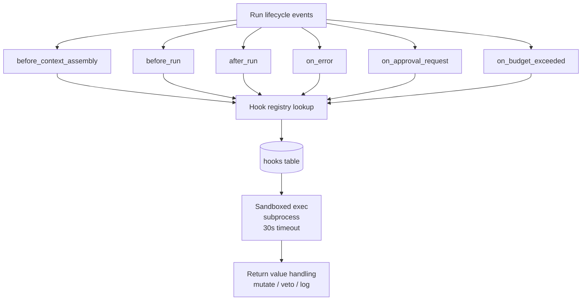
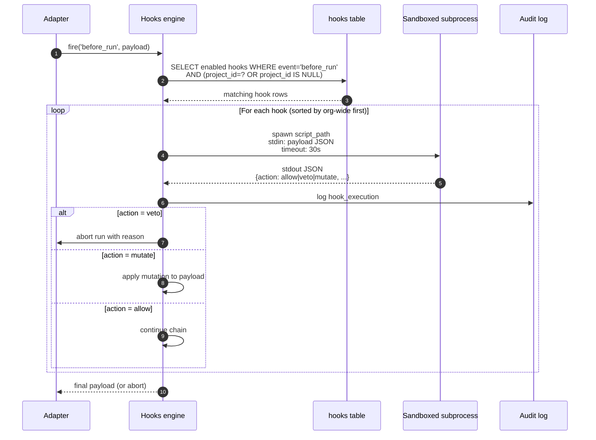
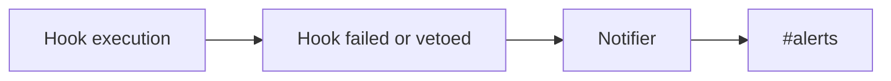

# Lifecycle Hooks

## Purpose

Engineer-pluggable scripts at run lifecycle events. Versioned, sandboxed, org-shareable. Lets a team push policies like "all payments-service runs must log a PII check" without modifying Dandori core. Hooks become a shared organizational asset, not laptop-local bash.

## Architecture



## Data model

```sql
CREATE TABLE hooks (
  id              TEXT PRIMARY KEY,
  project_id      TEXT,           -- NULL = org-wide
  event           TEXT NOT NULL,  -- before_run, after_run, etc.
  script_path     TEXT NOT NULL,
  enabled         BOOLEAN NOT NULL DEFAULT 1,
  owner_id        TEXT NOT NULL,
  version         INTEGER NOT NULL,
  created_at      DATETIME NOT NULL
);

CREATE TABLE hook_executions (
  id              TEXT PRIMARY KEY,
  hook_id         TEXT NOT NULL,
  run_id          TEXT NOT NULL,
  event           TEXT NOT NULL,
  exit_code       INTEGER,
  duration_ms     INTEGER,
  output          TEXT,           -- stdout JSON
  error           TEXT,
  executed_at     DATETIME NOT NULL
);
```

## Processing flow



## Example hook

```bash
#!/usr/bin/env bash
# hook: before_run
# fires before runtime is invoked
# input via stdin: {run_id, agent_id, prompt, context_versions}
# output via stdout: {action: "allow"|"veto", reason?: string}

PROMPT=$(jq -r '.prompt' <&0)

if echo "$PROMPT" | grep -q "DROP TABLE"; then
  echo '{"action":"veto","reason":"forbidden SQL pattern"}'
  exit 0
fi

echo '{"action":"allow"}'
```

## Hook events

| Event | Fires when | Can mutate | Can veto |
|---|---|---|---|
| `before_context_assembly` | After task picked, before context resolver runs | context filters | ✗ |
| `before_run` | After context + skills assembled, before runtime spawn | prompt, args | ✓ |
| `after_run` | After runtime exits, before quality gates | output annotations | ✗ |
| `on_error` | Any unhandled error during run | — | retry / escalate |
| `on_approval_request` | Task enters REVIEW status | notification routing | ✗ |
| `on_budget_exceeded` | Project / agent budget threshold crossed | — | throttle |

## Ecosystem integration

### Slack



### GitHub Enterprise

A `before_run` hook can call GitHub API to verify "PR has at least 1 reviewer assigned" before letting an agent finish.

### Custom

Hooks can call any HTTP API your team uses (PagerDuty, Datadog, internal compliance API). The hook pattern is intentionally generic.

## Tech specifics

- Hooks run as sandboxed subprocesses (`execa` with cwd, env allowlist, timeout)
- Hook scripts can be bash, python, node, or any executable
- Org-wide hooks (project_id=NULL) run before project-specific hooks
- Future: containerized execution for stronger isolation
- Hook versioning + diff + rollback follow the same pattern as context layers and skills

## See also

- [Approval Workflow]({{ site.baseurl }}) — uses `on_approval_request` hook for custom routing
- [Audit Log]({{ site.baseurl }}) — every hook execution logged
- [Cost Attribution]({{ site.baseurl }}) — `on_budget_exceeded` fires from this module
