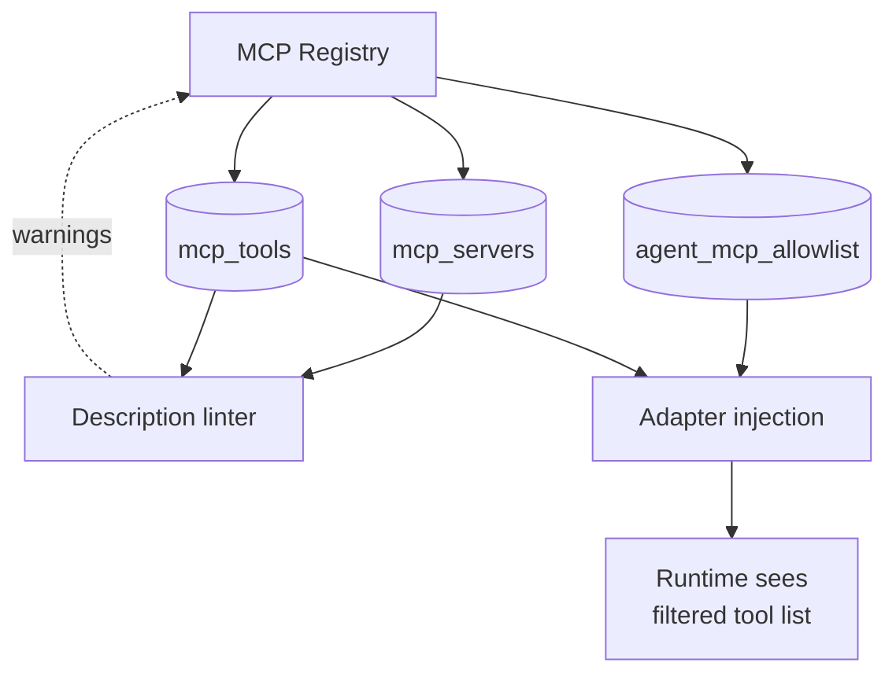
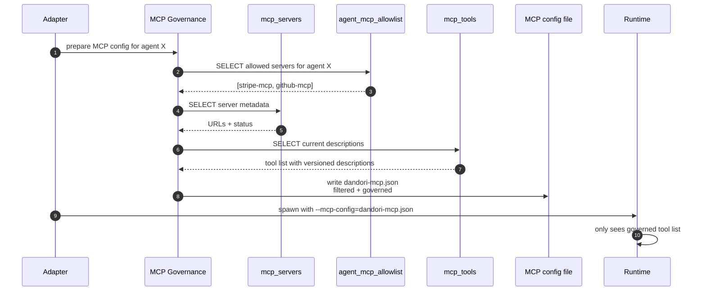
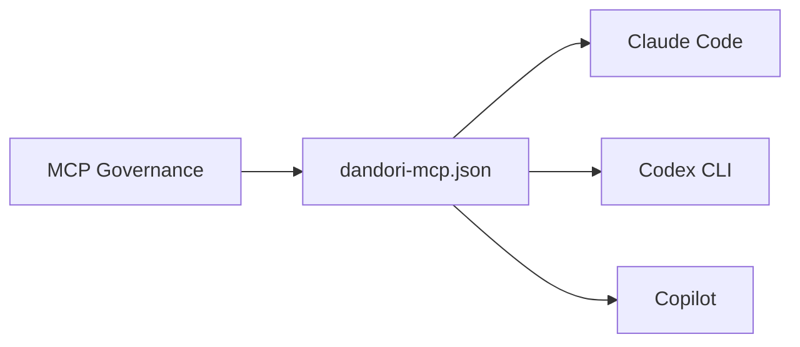
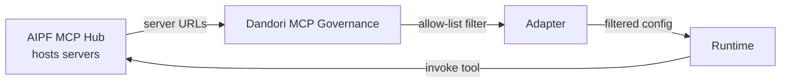

# MCP Tool Governance

## Purpose

Every engineer registers MCP servers locally with their coding agents. No org-wide visibility, no allow-list, no description governance. Bad descriptions burn context budget fleet-wide and nobody knows. Dandori adds the **governance layer** on top of MCP — without hosting MCP servers itself.

**Key boundary:** Dandori does NOT host MCP servers. It governs which ones each agent sees, versions their descriptions, and analyzes their usage. The actual MCP execution stays inside the runtime.

## Architecture



## Data model

```sql
CREATE TABLE mcp_servers (
  id              TEXT PRIMARY KEY,
  name            TEXT NOT NULL,
  url             TEXT NOT NULL,
  scope           TEXT NOT NULL,  -- 'org-wide' | 'team' | 'restricted'
  owner_team_id   TEXT,
  status          TEXT NOT NULL,  -- 'approved' | 'pending' | 'restricted'
  approved_by     TEXT,
  approved_at     DATETIME
);

CREATE TABLE mcp_tools (
  id              TEXT PRIMARY KEY,
  server_id       TEXT NOT NULL,
  name            TEXT NOT NULL,
  description     TEXT NOT NULL,
  description_version INTEGER NOT NULL,
  token_estimate  INTEGER,
  last_reviewed_at DATETIME,
  tags            TEXT
);

CREATE TABLE agent_mcp_allowlist (
  agent_id        TEXT NOT NULL,
  server_id       TEXT NOT NULL,
  PRIMARY KEY (agent_id, server_id)
);

CREATE TABLE mcp_tool_usage (
  run_id          TEXT NOT NULL,
  tool_id         TEXT NOT NULL,
  invoked_at      DATETIME NOT NULL,
  tokens_in       INTEGER,
  tokens_out      INTEGER
);
```

## Processing flow



## Description linter

Flags:
- **Bloated**: description > 500 tokens
- **Duplicate**: two tools with similar function (cosine similarity on embeddings)
- **Ambiguous**: tool name vague (e.g., "do_thing")
- **Stale**: not reviewed in > 90 days

## Ecosystem integration

### Claude Code, Codex CLI, GitHub Copilot

All three accept MCP server config at startup. Dandori writes a per-agent config file before spawning the runtime.



### MCP Hub (if AIPF deployed)



Dandori governs which AIPF MCP Hub tools each agent can see; MCP Hub still executes them.

## Tech specifics

- Description versioning + diff + rollback follow context layer pattern
- Lint runs on a schedule + on every description change
- Fleet usage analytics via `mcp_tool_usage` table → "which tools burn the most context budget across all agents"
- Security team can restrict tools that access external networks; restriction enforced at allow-list level

## See also

- [Inline Sensors]({{ site.baseurl }}) — sensors are Dandori-published MCP tools governed by this module
- [Skill Library]({{ site.baseurl }}) — `fetch_skill` is also a Dandori-published MCP tool
- [Audit Log]({{ site.baseurl }}) — every MCP tool invocation logged
