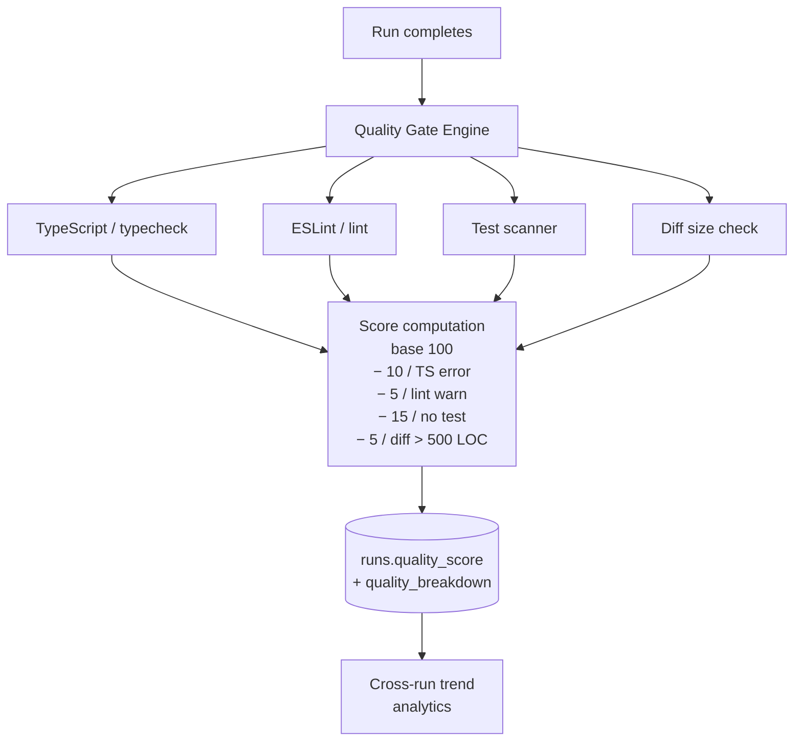
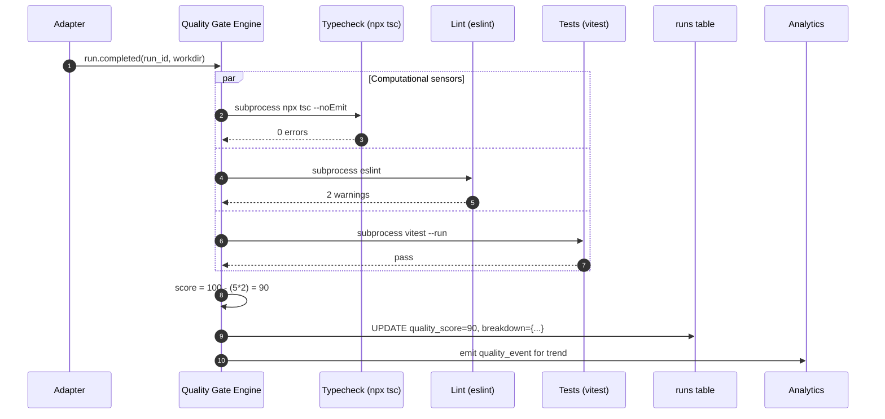
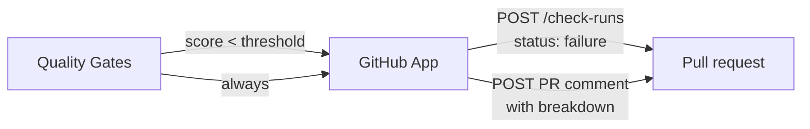
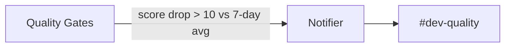

# Quality Gates

## Purpose

After every agent run completes, automatically run a configurable set of computational sensors (typecheck, lint, tests) and compute a quality score (0-100). Score is logged per run and rolled up into per-agent / per-team trend lines for leadership.

## Architecture



## Data model

```sql
ALTER TABLE runs ADD COLUMN quality_score INTEGER;
ALTER TABLE runs ADD COLUMN quality_breakdown TEXT; -- JSON

-- Project-level config
CREATE TABLE quality_gate_configs (
  project_id      TEXT PRIMARY KEY,
  enabled_sensors TEXT NOT NULL,  -- JSON array
  thresholds      TEXT NOT NULL,  -- JSON
  updated_at      DATETIME NOT NULL
);
```

## Processing flow



## Ecosystem integration

### GitHub Enterprise

Quality gate failure can post a PR check status; success can comment with the breakdown.



### Slack



## Tech specifics

- Each sensor is a subprocess invocation (`execa` / `child_process`) with timeout
- Outputs parsed into structured findings stored in `quality_breakdown` JSON
- Pluggable: project-level config selects which sensors run + their thresholds
- Sensors run in parallel for speed; total wall-clock typically &lt;30s
- Distinct from [Inline Sensors]({{ site.baseurl }}) which run *during* the agent's run

## See also

- [Inline Sensors]({{ site.baseurl }}) — same sensors but called by the agent mid-run for self-correction
- [Cross-agent Analytics]({{ site.baseurl }}) — consumes quality scores for trend lines
- [Use Case Flow 1 — Jira → PR → approval]({{ site.baseurl }}#flow-1-jira-issue--agent-run--pr-with-audit)
