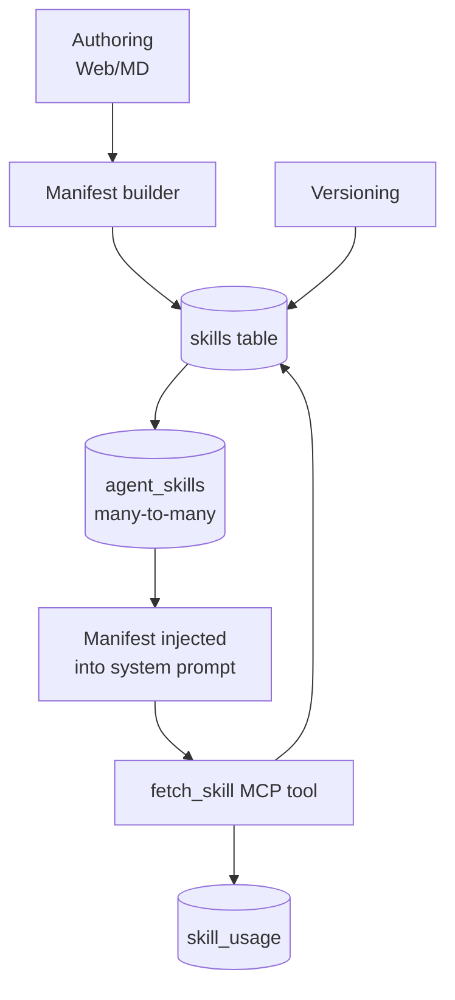
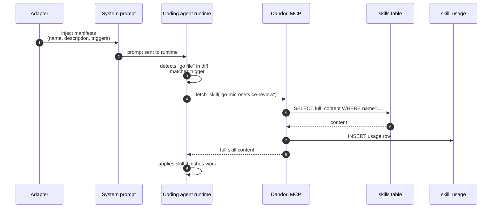
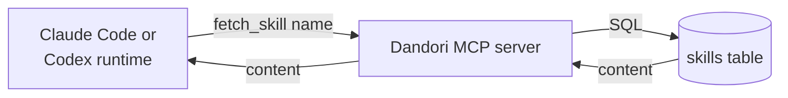
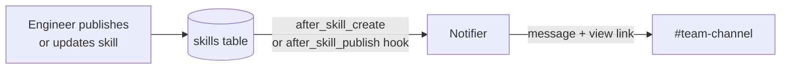

# Skill Library

## Purpose

Turn proven prompts from senior engineers into a versioned, shareable, lazy-loaded library. Skills attach to agents many-to-many. Only the manifest (name + description + triggers) sits in the system prompt; full content is fetched via MCP tool only when the agent actually needs it. Token savings at fleet scale are dramatic.

## Architecture



## Data model

```sql
CREATE TABLE skills (
  id              TEXT PRIMARY KEY,
  name            TEXT NOT NULL,
  manifest        TEXT NOT NULL,  -- JSON: name, description, trigger keywords
  full_content    TEXT NOT NULL,
  version         INTEGER NOT NULL,
  owner_team_id   TEXT,
  created_at      DATETIME NOT NULL
);

CREATE TABLE agent_skills (
  agent_id        TEXT NOT NULL,
  skill_id        TEXT NOT NULL,
  pinned_version  INTEGER,        -- NULL = always latest
  attached_at     DATETIME NOT NULL,
  PRIMARY KEY (agent_id, skill_id)
);

CREATE TABLE skill_usage (
  run_id          TEXT NOT NULL,
  skill_id        TEXT NOT NULL,
  fetched_at      DATETIME NOT NULL
);
```

## Processing flow (progressive disclosure)



## Ecosystem integration

### Claude Code & Codex CLI (via MCP)



### GitHub Copilot

Same MCP path — Copilot in VS Code calls `fetch_skill` when triggered by an engineer's question, returning team-published patterns inline in the chat.

### Slack



## MVP vs full scope

Skill Library ships in two phases so that a team pilot can get value early without waiting for the MCP server.

**MVP (Milestone M2):** Basic shared skills
- Skills stored as versioned markdown with owner team
- Full content injected into system prompt on every run (no lazy loading)
- Shared authoring, version history, diff, rollback
- Already delivers the core "knowledge stays with org, not laptop" value

**Full scope (Milestone M5):** Progressive disclosure
- Only manifest (name, description, triggers) in system prompt
- Full content lazy-loaded via `fetch_skill` MCP tool when agent explicitly needs it
- Dramatic token savings at fleet scale
- Requires built-in MCP server (M5 prerequisite)

Teams can stop at MVP and still claim "shared skill library" in their org. Progressive disclosure is a *token efficiency* upgrade, not a functional one.

## Tech specifics

- Manifest is ~200 tokens; full content can be 2-10k tokens
- Token savings at fleet scale: a team of 10 engineers running 50 runs/day across 5 attached skills can save **~500k tokens/day**
- `pinned_version=null` → agent always picks up latest
- Skill versions are immutable; `version` increments monotonically
- Usage analytics show which attached skills are actually fetched (auto-prune candidates)

## See also

- [Context Hub]({{ site.baseurl }}) — the other "guides" module
- [MCP Tool Governance]({{ site.baseurl }}) — fetch_skill is a Dandori-published MCP tool
- [Use Case Flow 3 — Publish team skill]({{ site.baseurl }}#flow-3-engineer-publishes-a-team-skill)
