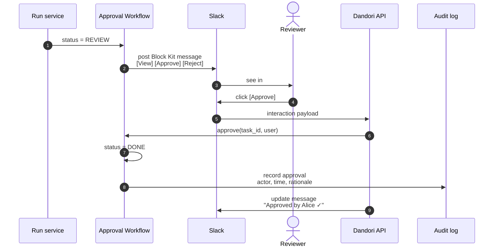
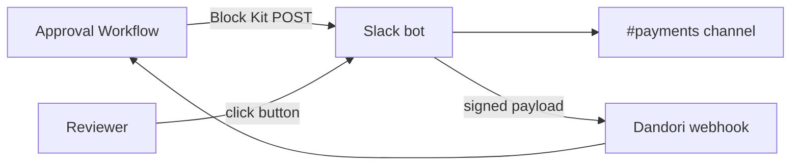
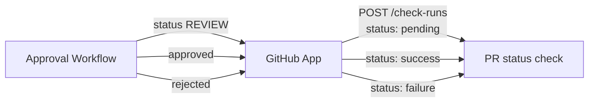

# Approval Workflow

## Purpose

Insert human review gates into agent execution. Tasks flagged `needs_approval=true` stop at status REVIEW until a human approves. Every approval (and rejection) is logged with who, when, and why. Reviewers see full prompt, context versions, diff, quality results, and self-explanation in one view.

## Architecture

```mermaid
flowchart TB
    Run[Run completes<br/>task.needs_approval=true]
    Status[task.status = REVIEW]
    Fan[Notification fan-out]
    Slack[Slack interactive]
    Email[Email digest]
    Inbox[In-app inbox]
    Rev[Reviewer opens task]
    View[Sees: prompt + context versions + diff + quality + self-explanation]
    Decide{Approve or Reject}
    Done[task.status = DONE]
    Todo[task.status = TODO + rejection reason]
    Audit[(audit_events)]

    Run --> Status
    Status --> Fan
    Fan --> Slack
    Fan --> Email
    Fan --> Inbox
    Slack --> Rev
    Email --> Rev
    Inbox --> Rev
    Rev --> View
    View --> Decide
    Decide -->|approve| Done
    Decide -->|reject| Todo
    Done --> Audit
    Todo --> Audit
```



## Data model

```sql
CREATE TABLE approvals (
  id              TEXT PRIMARY KEY,
  task_id         TEXT NOT NULL,
  run_id          TEXT NOT NULL,
  decision        TEXT NOT NULL,  -- 'approved' | 'rejected'
  decided_by      TEXT NOT NULL,
  decided_at      DATETIME NOT NULL,
  rationale       TEXT,
  rejection_reason TEXT
);
```

## Processing flow



## Slack interactive message

Block Kit composition:

```
┌───────────────────────────────────┐
│ 🤖 Task T-4812 needs review       │
│ payments-service / Add stripe...  │
│ Cost $0.42  Quality 87  Trace 11  │
│                                   │
│ [ View ] [ Approve ] [ Reject ]   │
└───────────────────────────────────┘
```

## Ecosystem integration

### Slack (interactive — bidirectional)



**Auth:** Slack Bot token + signing secret. Inbound interactions verified via HMAC.

### Email

Optional — uses SMTP / SES for notifications when Slack is down or for non-Slack users. One-click approve link with signed token.

### GitHub Enterprise



## Tech specifics

- Approvals are immutable; a rejected task can be re-submitted but creates a new approval row
- Multi-approver flow (e.g., requires 2 of 3 reviewers) is config per project
- Time-out: tasks in REVIEW > N days emit a stale-approval alert
- Approval history exportable in compliance pack (see [Audit Log]())

## See also

- [Task Board]() — owns the status field this module flips
- [Audit Log]() — every decision recorded
- [Use Case Flow 1 — Jira → PR → approval](#flow-1-jira-issue--agent-run--pr-with-audit)
