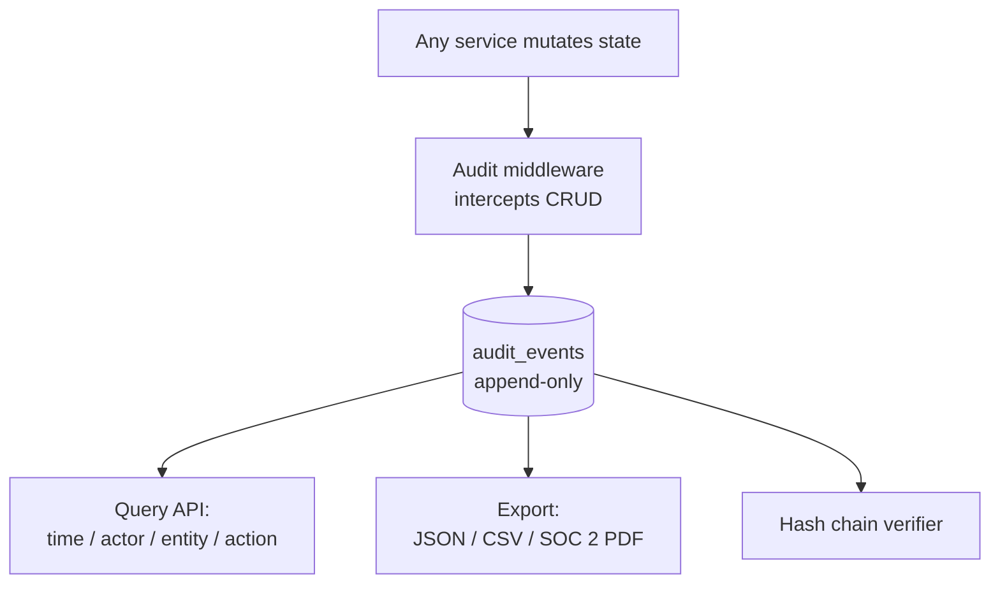
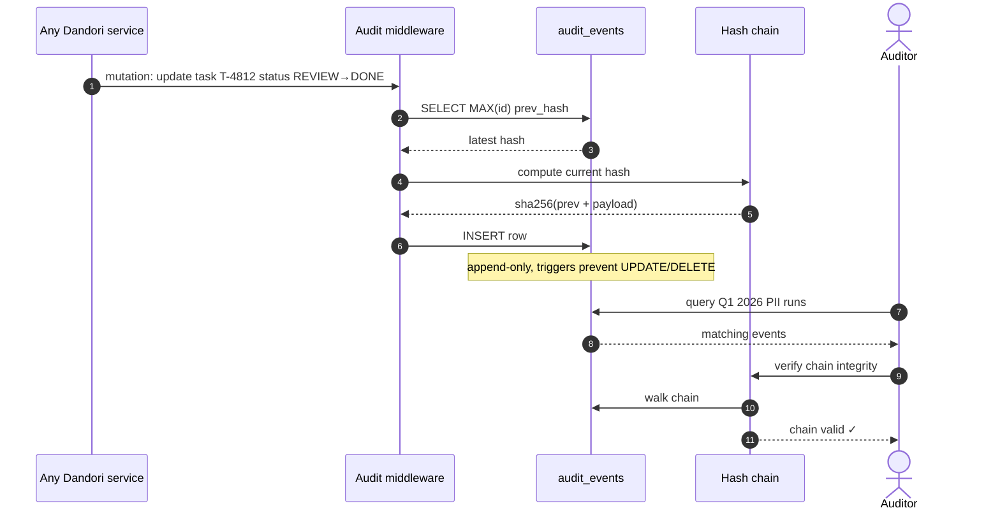
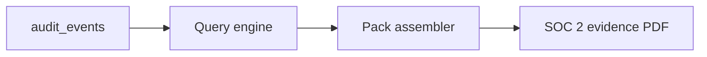
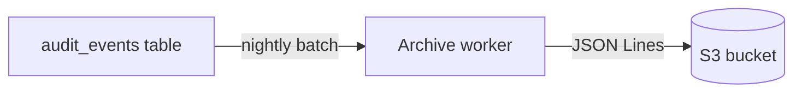

# Audit Log

## Purpose

Immutable record of every state mutation — for compliance evidence, incident replay, and forensic queries. Append-only by design. Optional hash chain (`current.hash = sha256(prev.hash + current.payload)`) gives tamper-evidence in production.

## Architecture



## Data model

```sql
CREATE TABLE audit_events (
  id              INTEGER PRIMARY KEY AUTOINCREMENT,
  actor_type      TEXT NOT NULL,  -- 'user' | 'agent' | 'system'
  actor_id        TEXT NOT NULL,
  entity_type     TEXT NOT NULL,  -- 'task' | 'context_layer' | 'skill' | ...
  entity_id       TEXT NOT NULL,
  action          TEXT NOT NULL,  -- 'create' | 'update' | 'delete' | 'approve' | 'execute'
  before_data     TEXT,           -- JSON snapshot
  after_data      TEXT,           -- JSON snapshot
  metadata        TEXT,           -- JSON
  hash            TEXT,           -- sha256(prev_hash + payload)
  prev_hash       TEXT,
  occurred_at     DATETIME NOT NULL
);

-- enforce append-only via trigger
CREATE TRIGGER audit_no_update BEFORE UPDATE ON audit_events
  BEGIN SELECT RAISE(ABORT, 'audit_events is append-only'); END;
CREATE TRIGGER audit_no_delete BEFORE DELETE ON audit_events
  BEGIN SELECT RAISE(ABORT, 'audit_events is append-only'); END;
```

## Processing flow



## What gets audited

- Task mutations (create, update, delete, status changes)
- Context layer edits (every version saved)
- Skill creates / updates / attachments
- Approval decisions
- Hook executions (with output)
- Sensor results
- MCP tool invocations
- Budget threshold events
- User auth events

## Ecosystem integration

### Compliance Export



Pack includes: filtered events, context snapshots at point-in-time, approval records, hook executions, sub-agent traces, optional Sentinel events. Hash chain replay verifies integrity before delivery.

### S3 / Object storage (production)



Archives older than N days off DB to keep query latency low.

### External SIEM

Optional: emit events to Splunk / Elastic / Datadog via webhook for org-wide security monitoring.

## Tech specifics

- Append-only enforced at DB layer (triggers in SQLite, RLS in Postgres)
- Hash chain optional but recommended for production
- Retention configurable per project
- Query API supports time range, actor, entity, action filters
- For enterprise scale: partition by month, archive older partitions to S3

## See also

- [Approval Workflow]() — every decision audited here
- [Lifecycle Hooks]() — every hook execution audited
- [Use Case Flow 6 — Compliance audit pack](#flow-6-compliance-audit-show-me-pii-touching-runs-in-q1)
