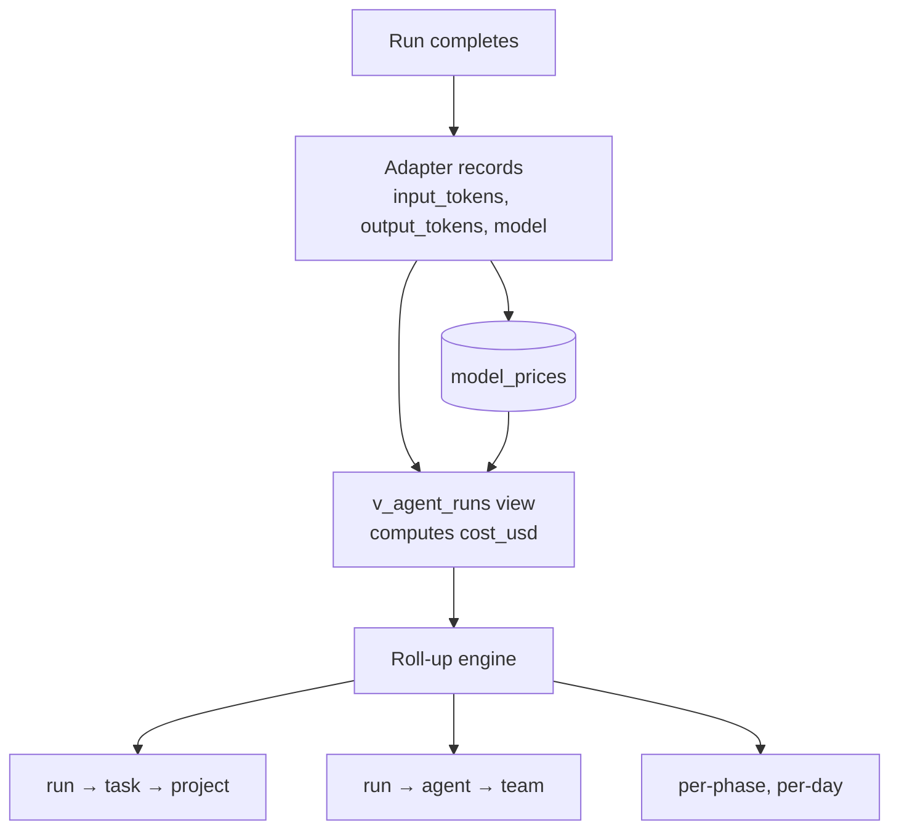
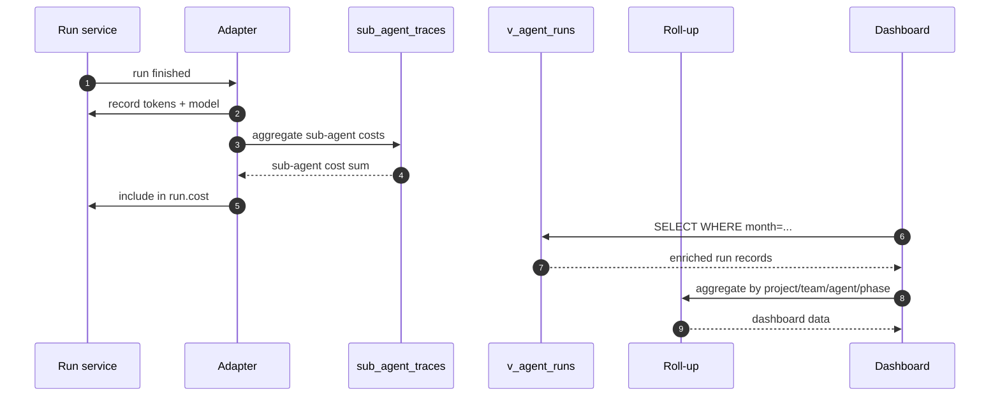
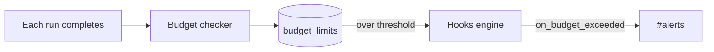
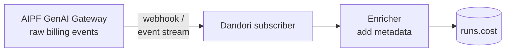
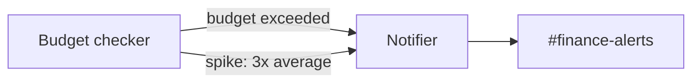

# Cost Attribution

## Purpose

Break agent spend down with the granularity leadership actually needs: project, team, agent, task, model, phase, sub-agent. Vendor billing aggregates everything; Dandori enriches each run with metadata at write-time so any breakdown is a SQL query away.

## Architecture



## Data model

```sql
CREATE TABLE model_prices (
  model_name      TEXT PRIMARY KEY,
  input_per_mtok  REAL NOT NULL,   -- $ per million input tokens
  output_per_mtok REAL NOT NULL,
  cache_read_per_mtok  REAL,
  cache_write_per_mtok REAL,
  effective_from  DATETIME NOT NULL
);

CREATE VIEW v_agent_runs AS
SELECT
  r.id, r.task_id, r.agent_id, r.project_id,
  r.input_tokens, r.output_tokens, r.model_name,
  r.started_at, r.ended_at,
  ((r.input_tokens / 1e6) * mp.input_per_mtok)
    + ((r.output_tokens / 1e6) * mp.output_per_mtok) AS cost_usd
FROM runs r
LEFT JOIN model_prices mp ON r.model_name = mp.model_name;
```

## Processing flow



## Budget ceilings & spike alerts



`budget_limits` table per agent / project / team. Soft alerts and hard stops configurable.

## Ecosystem integration

### GenAI Gateway (if AIPF deployed)



Dandori subscribes to billing events, enriches with agent/task/project context, stores in run records.

### Slack



### Email

Monthly cost summary email to finance team — generated from `v_agent_runs` aggregations.

## Tech specifics

- `model_prices` is configurable; easy to update when providers change pricing
- `v_agent_runs` is a view (not materialized) — fine for team scale; promote to materialized view for enterprise scale
- Roll-up engine queries are scoped via SQL `GROUP BY` chains — no separate aggregation pipeline
- Sub-agent costs roll up via [Sub-agent Trace]() parent_run_id

## See also

- [Cross-agent Analytics]() — uses cost data for cost-per-quality ratios
- [Lifecycle Hooks]() — fires `on_budget_exceeded`
- [Use Case Flow 5 — Cost review](#flow-5-leadership-monthly-cost-review)
