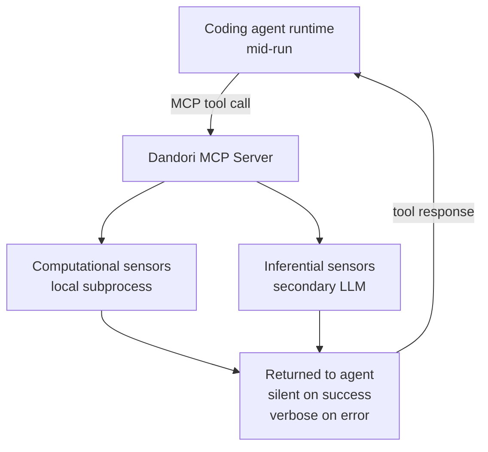
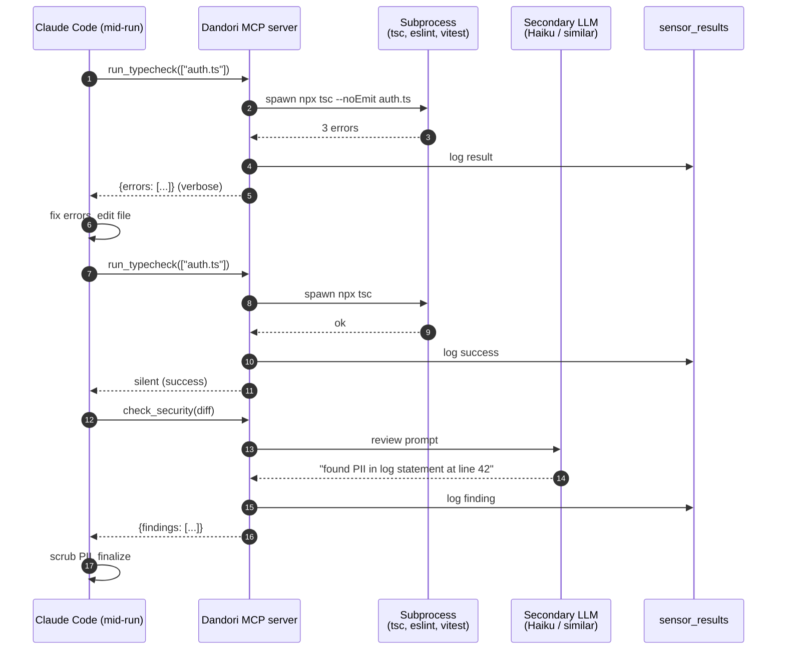
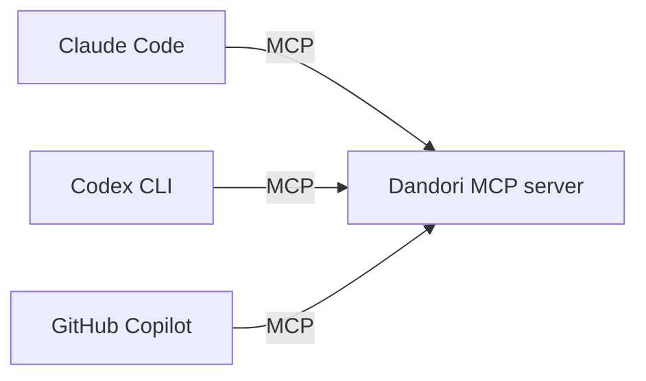

# Inline Sensors

## Purpose

True back-pressure: expose sensors as MCP tools so the agent calls them *during* its run and self-corrects *before* finishing. Two flavors:

- **Computational sensors** — typecheck, lint, tests (deterministic, milliseconds)
- **Inferential sensors** — AI-powered review via secondary LLM (semantic, slower)

The agent reads sensor output mid-run instead of waiting for human review.

## Architecture



## Tools exposed

| Tool | Type | Latency |
|---|---|---|
| `run_typecheck(file_paths[])` | Computational | &lt; 500ms |
| `run_lint(file_paths[])` | Computational | &lt; 500ms |
| `run_tests(scope)` | Computational | seconds |
| `check_security(diff)` | Inferential (LLM) | ~3-5s |
| `check_arch_fitness(file_paths[])` | Inferential (LLM) | ~3-5s |
| `check_schema_match(migration)` | Inferential (LLM) | ~3-5s |

## Sensor chain definition

```yaml
# project: payments-service
sensor_chains:
  default:
    - run_typecheck
    - run_lint
    - run_tests
  migrations:
    - run_typecheck
    - run_tests
    - check_schema_match    # inferential, custom
    - check_security        # inferential, default
```

Stored in DB as `sensor_chains` table; versioned and ownable by Platform team.

## Processing flow



## Ecosystem integration

### Claude Code, Codex CLI, GitHub Copilot

All three support MCP tool calls. The same Dandori MCP server exposes inline sensors to all of them.



### GitHub Enterprise (for inferential sensors)

Inferential sensors that need diff context call GitHub for the PR diff.


## Tech specifics

- Computational sensors run in subprocess isolation; output formatter follows HumanLayer pattern: `silent on success, verbose on error with file:line markers`
- Inferential sensors call a smaller/faster model (e.g., Haiku) to keep latency &lt; 5s
- Secondary LLM call cost is attributed to the parent run via [Cost Attribution]()
- Sensor failures don't fail the run by default; the agent decides what to do with the feedback
- Sensor chains can require specific sensors to pass before run completion (gate mode)

## See also

- [Quality Gates]() — same sensors, but run *after* the agent finishes
- [MCP Tool Governance]() — sensors are Dandori-published MCP tools
- [Use Case Flow 2 — Multi-phase DAG](#flow-2-multi-phase-feature-dag)
