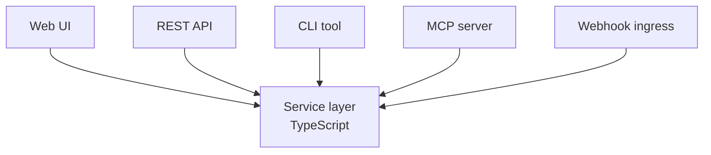
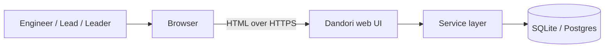
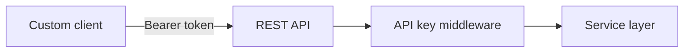
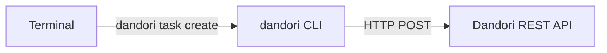
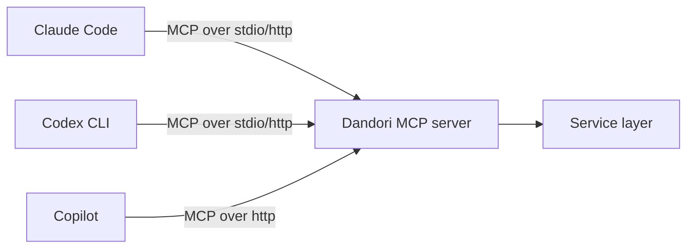
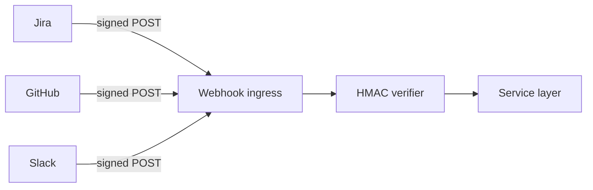

# Integration Surface

## Purpose

Engineers should pick the interface that fits their workflow. Same operations available via Web UI, REST API, CLI, MCP server, and webhook ingress. Same data, same logic, no second source of truth.

## Architecture



All five surfaces are thin wrappers over the same TypeScript service layer. Adding an operation to the service automatically gets it surfaced via REST + MCP; UI and CLI are added explicitly.

## The 5 surfaces

| Surface | Best for | Tech |
|---|---|---|
| **Web UI** | Human workflows: kanban, dashboards, dropdowns, approval review | Server-rendered HTML + minimal JS, dark/light theme |
| **REST API** | Custom integrations, scripts, automation | Express + OpenAPI 3.0 spec, autogen clients |
| **CLI** | Terminal-native engineers, CI/CD steps | Single shell binary `dandori` wrapping REST |
| **MCP server** | Coding agents in IDEs (Claude Code, Codex, Copilot) | Built-in MCP server exposing operations as tools |
| **Webhook ingress** | Inbound from Jira, GitHub, Slack interactions | Express route with HMAC verification |

## Web UI



Pages: Task Board, Context Hub, Skill Library, Agents, Runs, Analytics, Audit, Settings.

## REST API



OpenAPI 3.0 spec auto-published at `/openapi.json`. Client libraries autogenerated.

## CLI



Shell completions generated. Auth via env var `DANDORI_API_KEY`.

```bash
dandori task create "Fix webhook bug"
dandori task list --project payments --status review
dandori run logs R-9201
dandori cost today --by-agent
```

## MCP server



Tools exposed:

| Tool | Module |
|---|---|
| `get_context(scope, id)` | Context Hub |
| `fetch_skill(name)` | Skill Library |
| `run_typecheck(files)` | Inline Sensors |
| `run_lint(files)` | Inline Sensors |
| `run_tests(scope)` | Inline Sensors |
| `check_security(diff)` | Inline Sensors |
| `create_task(spec)` | Task Board |
| `create_subtask(parent, spec)` | Task Board |
| `update_status(id, status)` | Task Board |
| `request_approval(task_id, rationale)` | Approval Workflow |
| `lookup_audit(query)` | Audit Log |

## Webhook ingress



Each integration has its own route under `/api/integrations/{provider}/webhook`. Signing secrets in env vars.

## Ecosystem integration summary

This module is the **glue** — every other module's external touch points live here. Specifically:

| Tool | Surface used |
|---|---|
| Claude Code | MCP server (in) + adapter (out, separate) |
| Codex CLI | Adapter (out, separate) |
| GitHub Copilot | MCP server (in) |
| Jira | Webhook ingress + REST API (out) |
| Confluence | REST API (out, scheduled) |
| GitHub Enterprise | Webhook ingress + REST API (out via GitHub App) |
| Google Drive | REST API (out via OAuth2) |
| Slack | Webhook ingress + REST API (out via Bot) |

Detail per ecosystem tool is on the corresponding module's page (e.g., Jira details on [Task Board]()).

## Tech specifics

- Service layer is the single source of business logic; surfaces are thin
- REST endpoints are generated from service definitions where possible
- MCP tool descriptions are governed by [MCP Tool Governance]()
- Webhook signing secrets are per-provider, stored in sealed secrets directory

## See also

- [MCP Tool Governance]() — governs the tools this surface exposes to coding agents
- All other modules — each module's operations are surfaced via this module
