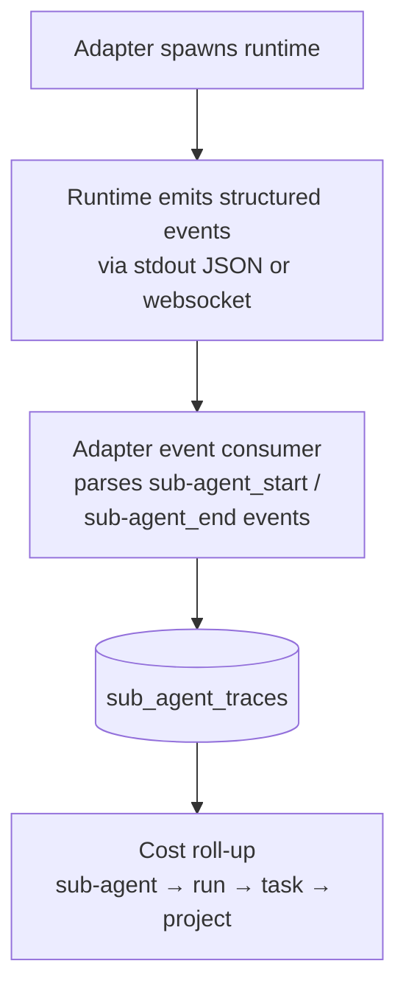
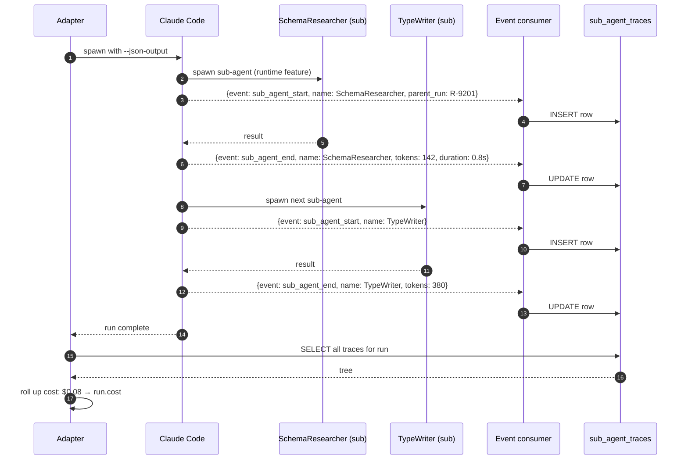
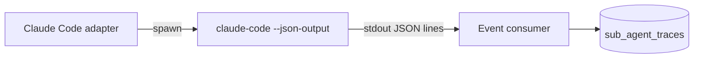

# Sub-agent Trace

## Purpose

Modern coding agent runtimes (Claude Code sub-agents, LangGraph) do intra-run multi-agent work. Without observability, Dandori is blind to it — only sees the top-level run. This module **observes** sub-agent activity via adapter protocol extension, persists traces, and rolls up cost. **Dandori does not spawn sub-agents** — runtimes do (inner harness).

## Architecture



## Data model

```sql
CREATE TABLE sub_agent_traces (
  id              TEXT PRIMARY KEY,
  parent_run_id   TEXT NOT NULL,
  parent_trace_id TEXT,           -- for nested sub-agents
  name            TEXT NOT NULL,
  started_at      DATETIME NOT NULL,
  ended_at        DATETIME,
  input_tokens    INTEGER,
  output_tokens   INTEGER,
  cost_usd        REAL,
  output_summary  TEXT,
  tool_calls      TEXT,           -- JSON array
  exit_code       INTEGER
);
CREATE INDEX idx_sat_parent ON sub_agent_traces(parent_run_id);
```

## Processing flow



## UI: expandable run view

```
Run R-9201 (task: implement-payment-webhook)
├── parent agent: PaymentImplementor
│     ├── sub-agent: SchemaResearcher (142 tokens, 0.8s)
│     │     └── tool calls: grep, read
│     ├── sub-agent: TypeWriter (380 tokens, 1.2s)
│     │     └── tool calls: write, run_typecheck
│     └── sub-agent: TestWriter (512 tokens, 2.1s)
│           └── tool calls: write, run_tests
│
└── total: 1,034 tokens, 4.1s, quality 87, cost $0.08
```

## Ecosystem integration

### Claude Code

Supported via `--json-output` mode. Adapter parses streamed JSON events from stdout.



### Codex CLI

Same protocol via `codex run --json-output` (in roadmap; protocol negotiation in progress).

### GitHub Copilot

N/A — Copilot runs in IDE, doesn't emit structured sub-agent events.

## Tech specifics

- Adapter protocol extension defines JSON event schema
- Trace tree is reconstructed via `parent_trace_id` for arbitrary nesting depth
- Sub-agent costs roll up to parent run via [Cost Attribution]()
- Policies enforceable: "sub-agents cannot exceed depth N", "sub-agent X cannot call tool Y" — enforced at adapter level
- Future: align JSON schema with OpenTelemetry GenAI spec when stable

## See also

- [Cost Attribution]() — sub-agent costs roll up here
- [Audit Log]() — sub-agent traces are queryable for compliance
- [Use Case Flow 6 — Compliance audit pack](#flow-6-compliance-audit-show-me-pii-touching-runs-in-q1)
