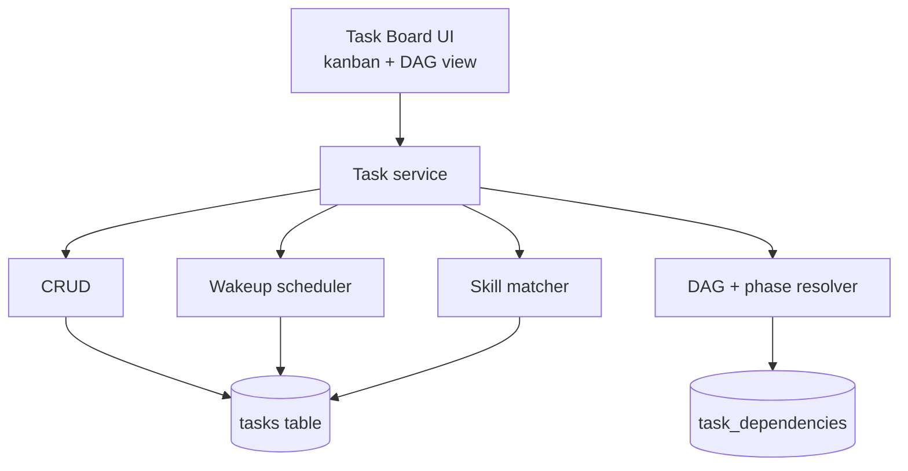
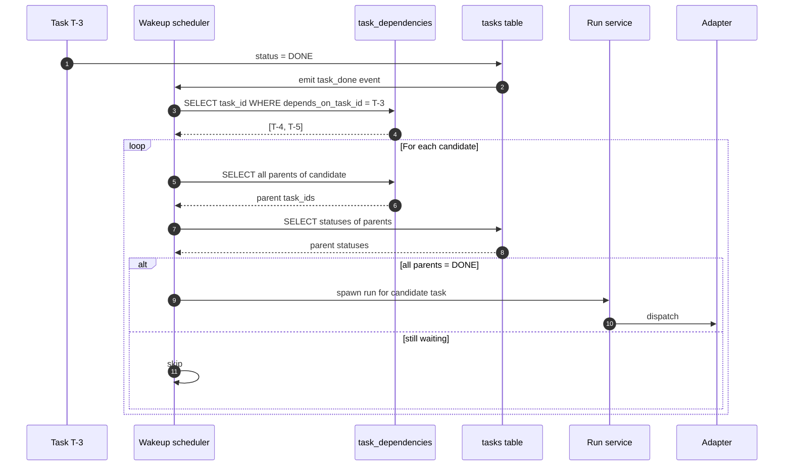
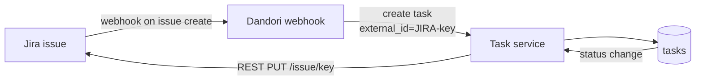
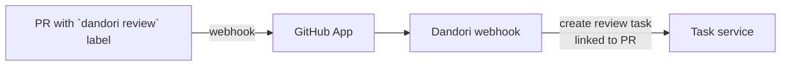

# Task Board

## Purpose

Coordinate multi-step agent work without engineers playing dispatcher in Slack. Tasks have phase tags, dependencies (DAG), and auto-wake when their parents complete. Skill matcher suggests the best agent for each task based on skill overlap.

## Architecture



## Data model

```sql
CREATE TABLE tasks (
  id              TEXT PRIMARY KEY,
  project_id      TEXT NOT NULL,
  phase           TEXT,           -- research|concept|requirement|design|implement|test|deploy|maintain
  status          TEXT NOT NULL,  -- TODO|IN_PROGRESS|REVIEW|DONE|REJECTED
  needs_approval  BOOLEAN NOT NULL DEFAULT 0,
  agent_id        TEXT,
  skill_tags      TEXT,           -- JSON array
  deadline        DATETIME,
  external_id     TEXT,           -- e.g. JIRA-1234
  created_at      DATETIME NOT NULL
);

CREATE TABLE task_dependencies (
  task_id              TEXT NOT NULL,
  depends_on_task_id   TEXT NOT NULL,
  PRIMARY KEY (task_id, depends_on_task_id)
);
```

Cycles prevented at insert time via topological check.

## Processing flow (auto-wakeup)



## Phase tags

`research → concept → requirement → design → implement → test → deploy → maintain`

Used for portfolio views: leadership can see "all design-phase tasks across the org" or "implement tasks blocked > 2 days."

## Ecosystem integration

### Jira (bidirectional)



| Jira | Dandori |
|---|---|
| Issue | Task |
| Issue type | Phase tag (Story → implement, Spike → research) |
| Sprint | Project sub-grouping |
| Assignee | Owner |
| Labels | Skill tags |
| Status | Task status |
| Due date | Task deadline |

### GitHub Enterprise



PR labeled `dandori review` creates a Dandori task assigned to ReviewerBot.

### Slack

```mermaid
flowchart LR
    User[User in Slack]
    Cmd[/dandori task create]
    SH[Slash command handler]
    TS[Task service]

    User -->|/dandori task create "..."| Cmd
    Cmd --> SH
    SH --> TS
```

## Tech specifics

- DAG cycle prevention runs at insert time
- Auto-wakeup is event-driven via the `task_done` event bus (in-process)
- Skill matcher uses Jaccard similarity between task `skill_tags` and agent `attached_skills`
- `external_id` indexed for bidirectional Jira/GitHub sync

## See also

- [Approval Workflow]() — gates tasks at status REVIEW
- [Skill Library]() — supplies skill metadata for matcher
- [Use Case Flow 2 — Multi-phase DAG](#flow-2-multi-phase-feature-dag)
