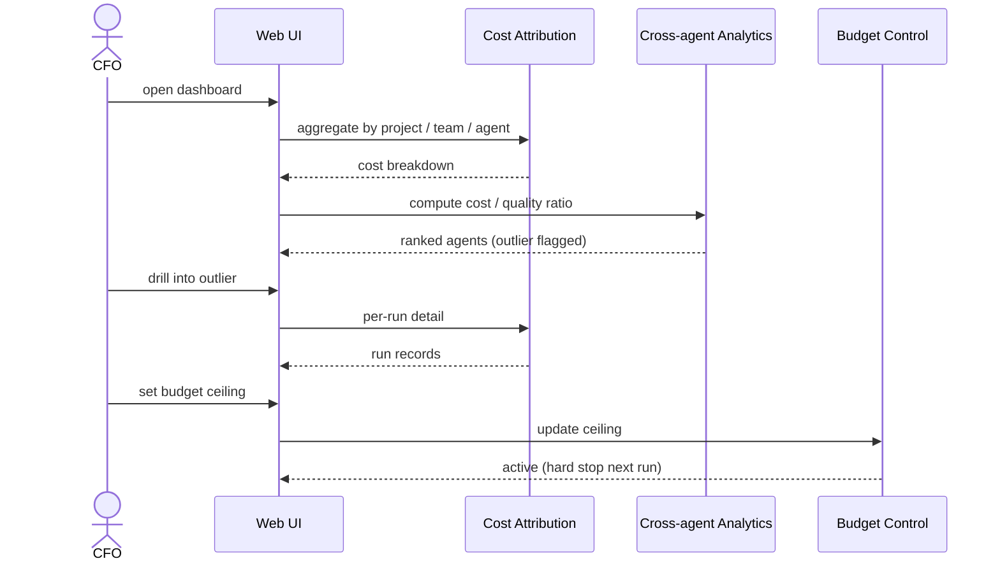
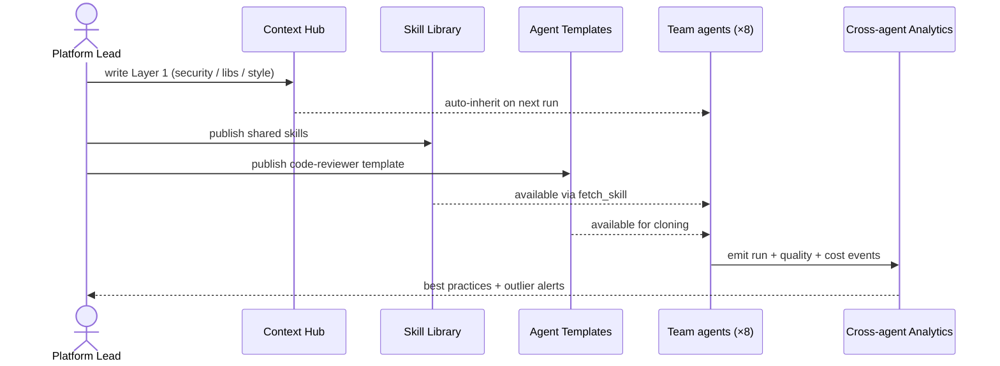
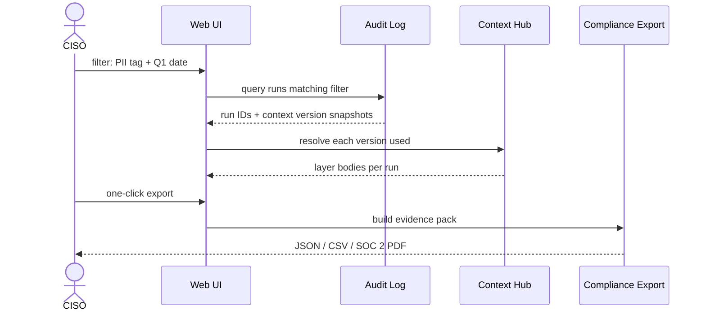
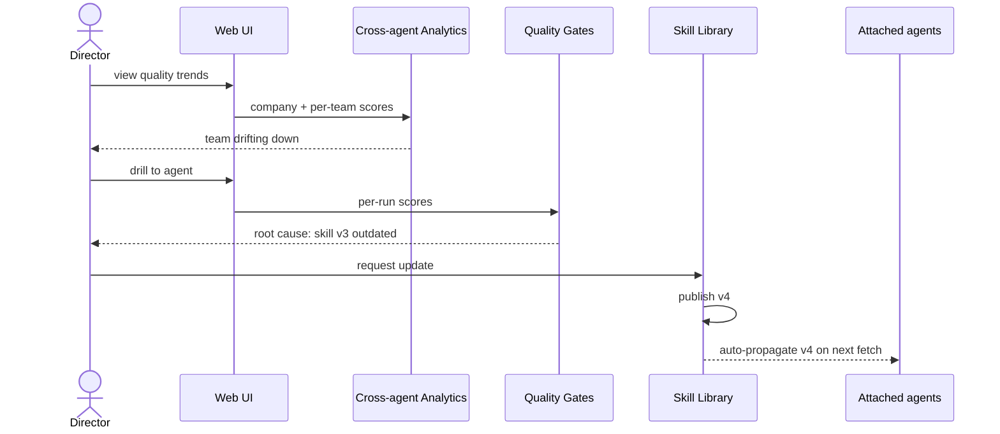
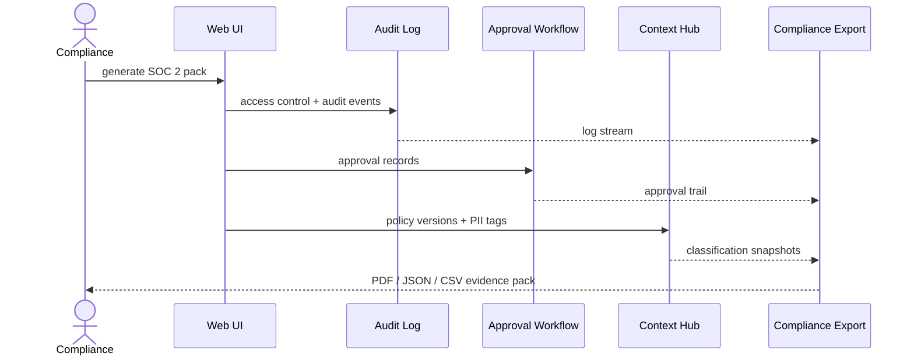
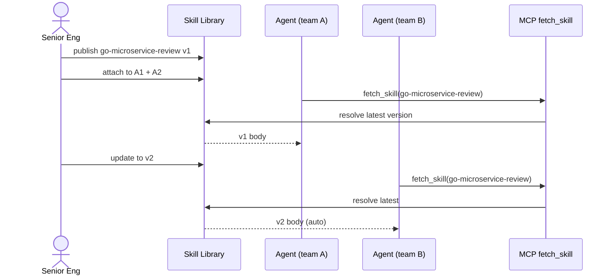
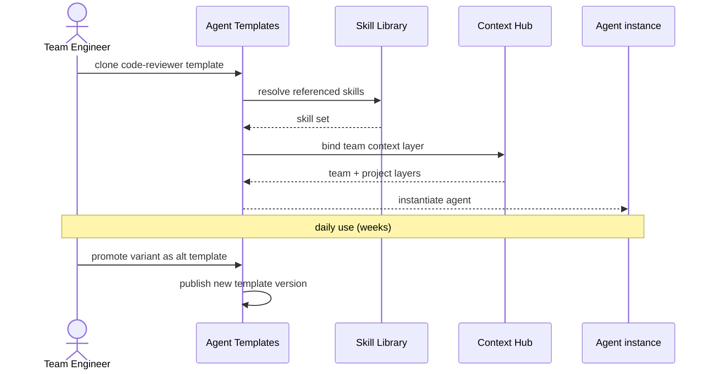
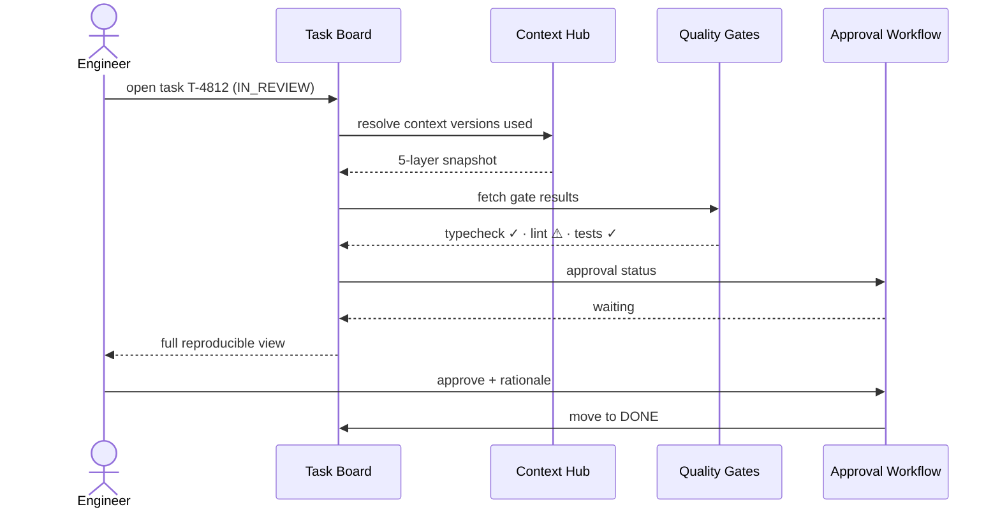
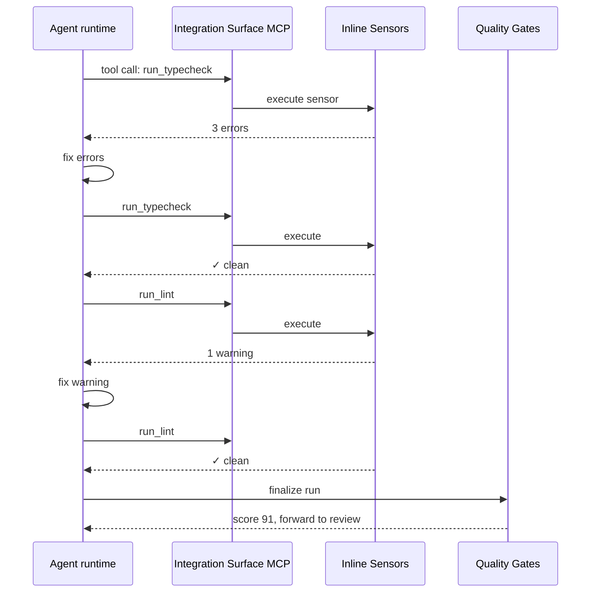

# Features & Workflows

13 modules implementing the [5 pillars]({{ site.baseurl }}#the-5-pillars), followed by how people actually use them.

Each module tagged by audience: 👷 Engineers · 🧭 Leadership · 🤝 Both.

---

## Pillar 1 — Cost Attribution

### 1. Cost attribution & budget control 🧭

Log every run: agent, task, project, model, input/output tokens, cost. Breakdown by any dimension. Budget ceilings per agent with hard stop. Spike detection alerts when an agent burns far above its baseline.

---

## Pillar 2 — Multi-layer Knowledge Flow

Knowledge is more than prompts. Three asset types flow through the same 5-layer hierarchy — all distributable top-down and contributable bottom-up.

### 2. Five-layer context governance 🤝

Context hierarchy: Company → Project → Team → Agent → Task. Each layer has an owner. Update once at the top → every agent inherits. Version-controlled with diff, rollback, and PII tags. Every run records which context versions it used.

### 3. Shared skill library 👷

Reusable prompt knowledge as versioned markdown. Attach any skill to any agent (many-to-many). **Progressive disclosure**: only skill name + description in system prompt; full content lazy-loaded via `fetch_skill` MCP tool when the agent needs it. Dramatic token savings across the fleet.

### 4. Agent templates 🤝

Pre-configured agent definitions — role, skill references, default instructions, sensor chain, MCP tool allow-list. Clone and customize. The Platform team publishes "code reviewer", "migration runner", "incident responder" templates. Any team instantiates them with their own project context. Versioned; template updates propagate to instances that opt in.

**How the 3 assets flow:**

```
                  TOP-DOWN DISTRIBUTION
                  ────────────────────▶
    Company ─── Project ─── Team ─── Agent ─── Task
    ◀────────────────────
                  BOTTOM-UP CONTRIBUTION

  Context  :  CTO sets policies  ·  Engineer contributes task learnings
  Skills   :  Platform publishes  ·  Engineer crafts prompt → promote
  Templates:  Platform publishes  ·  Team forks + shares successful variant
```

Same pattern, same governance, same versioning — applied to all three knowledge asset types.

---

## Pillar 3 — Task Tracking

### 5. Task dependencies & phase workflow 👷

Tasks with phase tags (research → design → implement → test → deploy). DAG dependencies with cycle prevention. Auto-wakeup: dependent tasks start when parents complete. Portfolio views by phase across projects.

### 6. Approval workflows 🤝

Tasks flagged `needs_approval` stop at In Review until a human approves. Every approval/rejection: who, when, rationale. Exportable for compliance. Slack interactive approvals for in-channel review.

### 7. Lifecycle hooks 👷

Pluggable scripts at `before_context_assembly`, `before_run`, `after_run`, `on_error`, `on_budget_exceeded`. Sandboxed with timeout. Versioned, auditable, org-wide or per-project. Platform team can mandate hooks (e.g., "all payment runs must log PII check").

---

## Pillar 4 — Quality Gates

### 8. Automated quality gates 🤝

Post-run pipeline independent of agent: typecheck, lint, security scan, coverage check. Quality score per run. Trend analytics per agent, per team, over time. Cross-agent comparison: which agents improve, which degrade.

**Why Outer needs this even though Inner has TDD:** Separation of Duties. The writer of code should not be the only judge. The agent can comment-out a test to pass faster — Outer gates catch that.

### 9. Inline sensors 👷

Mid-run sensors exposed as MCP tools. Agent calls `run_typecheck` or `run_lint` during execution and self-corrects before finishing. Computational sensors (typecheck, lint — ms) and inferential sensors (AI-powered security review — slower but deeper). Org-wide sensor definitions.

---

## Pillar 5 — Audit & Analytics

### 10. Immutable audit log 🧭

Every mutation logged: actor, timestamp, entity, before/after. Append-only at DB level. Optional hash chain for tamper-evidence. Exportable as JSON/CSV. Compliance-ready: SOC 2, ISO 27001, NIST AI RMF.

### 11. Cross-agent analytics 🧭

Per-agent KPIs: success rate, quality score, cost per run, duration. Trend detection (improving vs degrading). Phase breakdown (which phase burns most). Model comparison on matched tasks.

### 12. Sub-agent trace 🤝

Observe (not spawn) sub-agents inside runtime runs. Cost rolls up: sub-agent → parent run → task → project. Expandable tree view in UI. Policies: max depth, tool restrictions per sub-agent.

### 13. MCP tool governance 🤝

Org-wide MCP server registry. Per-agent and per-team allow-lists. Description versioning + linting (flag bloated descriptions). Usage analytics: which tools burn the most context fleet-wide. Security team veto for restricted tools.

---

## Foundation

### Unified integration surface 👷

Web UI, REST API (OpenAPI 3.0), CLI, built-in MCP server. Same operations on every interface. CI/CD via webhooks. Claude Code talks to Dandori via MCP from inside the IDE.

---

# Workflows

How people actually use Dandori — the scenarios, not the feature lists.

## Leadership scenarios

### CFO: "Where did the AI bill go?"

Opens Cost Attribution dashboard. Drills from total spend → top project → top agent by cost-to-quality ratio. Spots an outlier burning far above baseline at low quality. Action: investigate the outlier, shift low-complexity work to a cheaper model. **Minutes, not meetings.** Before Dandori: "we'll ask the teams" → spreadsheet next week.



### Platform lead: 8 teams, one standard

Sets Company context (Layer 1): security rules, approved libraries, style guide. Publishes shared skills and agent templates: `security-review`, `perf-analysis`, `api-design`. All 8 teams inherit automatically; each still owns its project + team context. Cross-team analytics spot best practices and flag outliers.



### CISO: "Show me PII-touching runs in Q1"

Queries audit log: runs where context contained PII-tagged layers, date range Q1. Result set with full context versions per run. One-click compliance export (JSON / CSV / SOC 2 format).



### Engineering Director: quality trending

Dashboard shows company quality trend + per-team breakdown. One team is drifting downward. Drill down: specific agent's score dropped — root cause: outdated skill version. Action: Platform team updates the skill, change propagates to every attached agent.



### Compliance: SOC 2 audit prep

One-click evidence pack: access control, change management, audit trail, data classification, policy enforcement, incident traceability. All the controls an auditor asks about, already logged. Before Dandori: a custom tooling project.



---

## Engineer scenarios

### Tech lead: multi-phase feature with 4 agents

Builds a DAG (research → design → implement → test → deploy). Each task auto-wakes when its parent completes. Each agent inherits company + project + team context + upstream outputs. Quality gates block downstream tasks if a gate fails. **No Slack dispatching, no copy-paste handoffs.**

```mermaid
sequenceDiagram
    actor TL as Tech Lead
    participant TB as Task Board
    participant CH as Context Hub
    participant AD as Adapter
    participant RT as Runtime (Claude Code)
    participant QG as Quality Gates

    TL->>TB: create DAG (T1 → T2 → T3 → T4 → T5)
    TB->>CH: assemble context for T1
    CH-->>TB: 5-layer prompt
    TB->>AD: run T1
    AD->>RT: spawn agent
    RT-->>AD: output
    AD->>QG: post-run gates
    QG-->>TB: score passes
    TB->>TB: auto-wake T2
    TB->>CH: assemble for T2 (+ T1 output)
    CH-->>TB: prompt with upstream
    Note over TB,QG: repeat T2 → T5;<br/>gate fail blocks downstream
```

### Senior engineer: publishing a team skill

Creates skill `go-microservice-review` v1 with review checklist. Attaches to agents across 2 teams. When skill updates to v2 → all attached agents pick it up automatically. New teammate's agent inherits day 1. **Knowledge stays with the org, not the individual.**



### Team engineer: forking an agent template

Clones the Platform team's `code-reviewer` template. Customizes it with team-specific context (style guide, service boundaries). Uses it for daily reviews. Two months later, shares the customized variant back for other teams to adopt.



### Mid-level engineer: picking up an in-review task

Opens Task Board → task in "In Review". Sees: full prompt sent to agent, assembled context versions (company v12, project v3, team v7), agent output with self-explanation ("What I did / Why / Risks"), quality gate results. **Full reproducible state — reviews without pinging anyone.**



### Agent during a run: self-correcting via sensors

Mid-run, agent calls `run_typecheck` via MCP. Gets errors back. Fixes them. Calls `run_lint` — 1 warning, fixes. Finishes run. Quality gate confirms. **Self-correction before human review, not after.**



---

## The pattern

```
  Engineers work INSIDE Dandori     Leaders see THROUGH Dandori
         │                                   │
         ▼                                   ▼
  ┌──────────────────────────────────────────────────┐
  │            Same database, same truth             │
  │                                                    │
  │  Policies propagate automatically                  │
  │  Every decision backed by data                     │
  │  Incidents become learnings                        │
  │  Knowledge stays with the org                      │
  └──────────────────────────────────────────────────┘
```

---

## Read next

[Architecture →]({{ site.baseurl }}) How the modules connect technically
{: .fs-5 }
