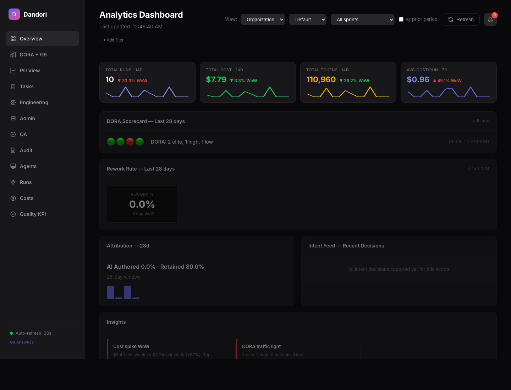
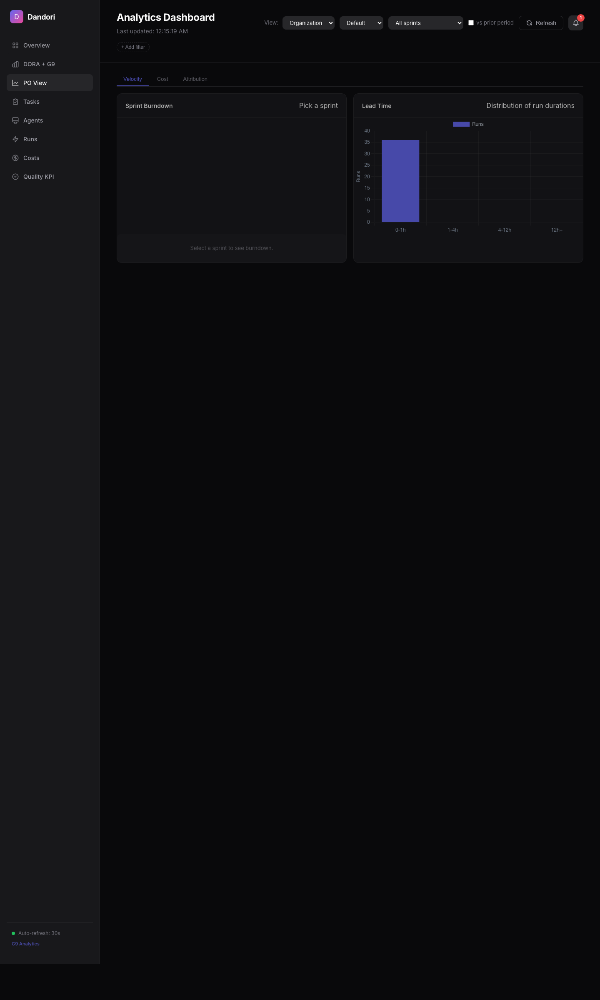
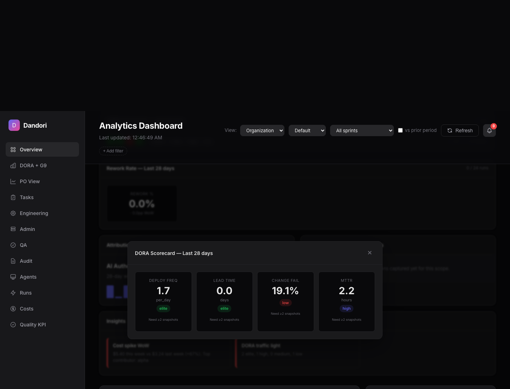

# Một công cụ trả lời câu hỏi tiền AI của sếp
{: .fs-9 }

*Bài viết blog — không phải slide. Dành cho người đọc không chuyên kỹ thuật vẫn hiểu được.*
{: .fs-5 .fw-300 }

*Unlisted page — share the direct URL only.*

---

## Mở đầu: những câu hỏi không ai trả lời được

Hãy thử tưởng tượng công ty bạn dùng AI mỗi ngày. Claude Code, Cursor, Copilot — mỗi dev gọi vài lần. Cuối tháng, hóa đơn AI về tới tay sếp.

Sếp hỏi đơn giản: *"Tiền này đi đâu?"*

Không ai trả lời được.

Thử hỏi thêm vài câu nữa:

- **Team A và Team B** — ai dùng AI hiệu quả hơn? Dựa vào đâu mà nói?
- Cái **migration sập staging sáng nay** — agent nào làm, ai approve, có test không?
- **Chất lượng code AI sinh ra** có đảm bảo không? Hay agent cứ comment-out test cho pass là xong?
- **Human vs agent** — dev thật và AI, so sánh công bằng thế nào?

Mấy câu này — hầu hết công ty đều tịt.

Và đây mới là điều thú vị: **đó không phải lỗi của AI**. AI làm việc tốt. Đó là lỗi của **lớp hạ tầng quản lý** xung quanh AI — cái lớp mà chưa ai đặt tên đúng.

Đội tôi gọi nó là **outer harness**. Và phiên bản nhỏ của nó — đội tôi đặt tên là **Dandori**.

---

## Dandori — một công cụ, hai việc

Để dễ hình dung: Dandori giống như **cái đồng hồ điện trong nhà bạn**. Nó không làm cho bạn tiết kiệm điện. Nó chỉ **cho bạn thấy** bạn đang tiêu điện vào đâu — để bạn tự biết chỗ nào lãng phí.

Dandori làm đúng hai việc:

### 1. Tracking — ghi lại mọi thứ

Mỗi lần ai đó trong công ty chạy AI (dù là Claude Code, Cursor, hay gì), Dandori tự động ghi:

- Ai chạy, task gì, mất bao lâu
- Tốn bao nhiêu token, ra bao nhiêu tiền
- Code thay đổi ra sao, test pass hay fail
- Task này trên Jira là cái gì, PR trên GitHub là cái nào

Người dùng **không cần làm gì thêm**. Họ dùng AI như bình thường. Dandori là một layer mỏng ngồi phía sau, lặng lẽ ghi chép.

Quan trọng hơn: Dandori **cũng kéo data của human engineer** từ Jira (task closed, cycle time) và GitHub (commits, PRs, review time). Nghĩa là agent và người **được đo trên cùng thước đo, cùng dashboard**.

### 2. Analytics — trả lời câu hỏi

Có data rồi, Dandori cho bạn query theo **sáu cấp độ**: **agent → engineer → task → team → project → department**.

Ví dụ câu hỏi thật sếp hay hỏi:

> *"Tháng này department Platform tiêu bao nhiêu cho AI? Chia theo project nào?"*

Trên Dandori: một dòng lệnh, ra số ngay.

> *"Team Auth và Team Billing — team nào dùng AI hiệu quả hơn trên cùng loại task?"*

Một dòng lệnh, ra bảng so sánh.

> *"Sáng nay có run nào vượt ngưỡng chất lượng không?"*

Một dòng lệnh, ra danh sách cần review kỹ.

*Dashboard tổng quan: bốn KPI tổng (runs, cost, tokens, avg cost), DORA scorecard, cost trend 7 ngày, cost theo agent, agent performance table, và quality KPI (regression rate, bug rate). Một màn hình, đủ trả lời "tháng này AI đang chạy thế nào".*

---

## Tại sao **mix human + agent** là khác biệt cốt lõi

Đa số công cụ hiện tại chỉ quản AI. Bạn thấy agent dùng bao nhiêu token, agent nào chạy lâu, agent nào fail.

Nhưng công ty phần mềm **không chỉ có AI**. Công ty có **cả dev thật lẫn AI**, và tương lai gần chắc chắn là **mix**, không phải thay thế hoàn toàn.

Khi công ty là mix, câu hỏi quản lý quan trọng nhất là:

> *"Alice + agent alpha vs Bob một mình — ai hiệu quả hơn? Đầu tư AI có đáng không?"*

Không có data chung, không trả lời được câu này. Sếp phải đoán.

Dandori kéo data từ **Jira + GitHub + agent runs**, đưa lên **cùng một dashboard**:

| Engineer | Agent | Tasks đóng | Cycle time | AC completion |
|---|---|---|---|---|
| Alice | alpha | nhiều | nhanh | cao |
| Bob | — | trung bình | chậm hơn | cao |
| Carol | beta | trung bình | nhanh nhất | dưới ngưỡng ⚠ |

Nhìn bảng này, sếp thấy ngay:

- **Alice + alpha**: throughput cao, chất lượng cao → model hiệu quả, nhân rộng.
- **Bob một mình**: chậm hơn nhưng chất lượng sát Alice → dev cứng, không cần ép dùng agent.
- **Carol + beta**: nhanh nhất nhưng chất lượng dưới ngưỡng → đang đi đường tắt, cần review.

Ba người, ba câu chuyện khác nhau. Cùng một dashboard. Đây là thứ **chỉ có khi human và agent cùng thước đo**.

*PO View: phân bố thời gian run (0–1h / 1–4h / 4–12h / 12h+). Lead time là một trong 4 metric DORA — ở đây cắt theo organization, có thể switch sang team / project / engineer. Cùng dashboard này dùng cho cả human runs (kéo từ Jira/GitHub) lẫn agent runs.*

---

## Đo hiệu quả bằng công thức chuẩn ngành — DORA

Một thứ đội tôi cố tình **không tự chế** là **công thức đo hiệu quả**.

Trong gần 10 năm qua, Google DORA (DevOps Research and Assessment) đã chuẩn hoá 4 metric đo hiệu quả của đội phần mềm. Đây là chuẩn ngành — được dùng rộng rãi, có benchmark giữa các công ty (Elite / High / Medium / Low). Dandori dùng **đúng 4 metric đó**, để khi sếp hỏi "team này hiệu quả không", câu trả lời có thể **so sánh với phần còn lại của thế giới**, không phải tự nói tự nghe.

**Bốn DORA metric, giải thích khái quát:**

- **Deploy frequency** — bao lâu một lần đẩy code lên production. Cao → dòng chảy nhanh, feedback nhanh. Thấp → batch lớn, rủi ro lớn mỗi lần release.
- **Lead time for changes** — từ lúc code commit đến lúc lên production. Ngắn → tổ chức linh hoạt. Dài → có nút thắt ở review, test, hoặc release process.
- **Change failure rate** — tỉ lệ deploy gây sự cố. Thấp → chất lượng trước khi release tốt. Cao → quality gate yếu hoặc thiếu test.
- **Mean time to restore (MTTR)** — sửa sự cố trong bao lâu. Ngắn → đội ngũ ứng cứu tốt, có rollback dễ. Dài → quy trình incident response chưa chín.

Bốn metric, đủ đo "tổ chức làm phần mềm đang chạy mượt cỡ nào".

**Điểm khác biệt của Dandori**: DORA gốc đo **đội người**. Khi công ty mix human + agent, câu hỏi mới xuất hiện: *"Agent có làm hỏng DORA không? Đầu tư AI có cải thiện DORA không?"*

Dandori **mở rộng DORA cho mix human+agent**:

- Mỗi DORA metric hiển thị **3 lát**: human-only, agent-only, mixed runs
- So sánh tương đối: "Tuần này agent runs giảm change failure rate vì test gate chặt hơn" hay "Lead time agent cao hơn vì rework loops nhiều"
- Theo dõi xu hướng: agent đang kéo DORA lên hay xuống — qua thời gian

Đây là chỗ Dandori đi xa hơn DORA truyền thống. Không phải đo lại 4 metric quen thuộc — mà **trả lời được câu hỏi đầu tư AI đáng không bằng đúng ngôn ngữ chuẩn ngành**.

*Cuộn xuống: regression rate và bug rate per agent, cost-quality adjusted (cost chia cho quality score). Đây là chỗ "đầu tư AI có đáng không" được trả lời cụ thể — không phải bằng cảm giác, mà bằng số có thể so với DORA benchmark ngành.*

---

## Chất lượng — đo bằng số, không tin cảm tính

Một điều đội tôi cẩn thận hơn người khác: **không bao giờ để AI tự chấm chất lượng công việc của AI**.

Agent rất dễ "pass" bằng cách comment-out test. Hoặc sinh code trông đẹp nhưng logic sai. Nếu bạn hỏi agent "chất lượng OK chưa?" — nó sẽ luôn trả lời "OK".

Vậy ai chấm?

**Quality gate** — các chỉ số chất lượng định nghĩa sẵn ở mức công ty: lint delta, test delta, commit message score, diff size, có AC đầy đủ không. Config **một lần**, Dandori enforce **mọi run, không miễn trừ**.

Quan trọng hơn: Dandori có **audit chain** — mỗi entry audit log có hash móc xích, có witness ngoài (Confluence). Ai đó cố sửa lại lịch sử (rebuild chain để giấu run sai) — verify sẽ phát hiện ra ngay. Không phải tin cảm tính. Có bằng chứng cryptographic.

Số không nói dối. Hash chain không nói dối.

---

## Giá trị thật của Dandori

Dandori không thay đổi cách dev dùng AI. Nó thay đổi cách **quản lý** dùng AI.

Trước Dandori, sếp phải **đoán** — đoán team nào hiệu quả, đoán đầu tư AI có đáng không, đoán run nào đang đốt tiền. Sau Dandori, sếp **nhìn dashboard, nói chuyện bằng số**.

Trước Dandori, kinh nghiệm prompt là **kiến thức ngầm** trong đầu vài senior. Senior nghỉ là mất. Sau Dandori, mỗi run được lưu, có thể search, có thể nhân rộng pattern hiệu quả.

Trước Dandori, "chất lượng AI" là **ý kiến cá nhân**. Sau Dandori, có ngưỡng config, có metric đo, có audit trail không sửa được.

Trước Dandori, "hiệu quả" mỗi công ty đo một kiểu — không so sánh được. Sau Dandori, dùng **DORA chuẩn ngành**, mở rộng cho mix human+agent.

Đây là giá trị thật — không phải feature list, mà là **thay đổi cách nói chuyện về AI trong công ty** từ cảm tính sang dữ liệu.

---

## Bạn mang về công ty được gì?

Giả sử bạn không ship Dandori ngay. Ba điều dưới đây, áp dụng được **tuần sau**, không cần công cụ gì:

**1. Đầu tư vào PBI trước khi đầu tư vào token.**
Mỗi giờ viết AC rõ tiết kiệm rất nhiều giờ sửa output AI. Đây là ROI cao nhất của AI mà không ai nói.

**2. Đo human và agent trên cùng thước đo — bằng công thức chuẩn ngành.**
Đừng tự chế metric "hiệu quả". Dùng DORA (deploy frequency, lead time, change fail rate, MTTR) — và mở rộng cho mix human+agent. Đây là cách duy nhất để câu trả lời "đầu tư AI có đáng không" có thể so sánh với phần còn lại của thế giới.

**3. Quality gate đo bằng số, không tin cảm tính.**
Đừng để dev tự chấm. Đừng để AI tự chấm. Định nghĩa ngưỡng, công cụ đo. Khi có tranh cãi, nhìn số. Tăng độ tin cậy bằng audit chain có witness ngoài.

Dandori chỉ là cái công cụ. Ba điều trên là **process**. Process quan trọng hơn công cụ.

---

## Câu hỏi cũ, câu hỏi mới

Câu hỏi cũ, ai cũng hỏi:

> *"AI có thay được developer không?"*

Câu hỏi này sai. Không phải vì câu trả lời khó. Vì nó **đặt vấn đề nhầm chỗ**.

Câu hỏi đúng:

> *"Công ty có đủ kỷ luật process để AI làm việc hiệu quả không?"*

Câu trả lời của đội tôi: **có**. Bằng một công cụ nhỏ và một process chuẩn — đo bằng số, không tin cảm tính.

---

*Link slide 2 phút thuyết trình hackday: [slides-dandori-2min.html]({{ site.baseurl }}/hackday/slides-dandori-2min.html) · Kiến trúc đề xuất (chứng minh khả thi): [architecture-dandori.html]({{ site.baseurl }}/hackday/architecture-dandori.html) · Phụ lục hackday (phạm vi demo + cách build bằng AI agent): [blog-hackday-appendix.html]({{ site.baseurl }}/hackday/blog-hackday-appendix.html)*
