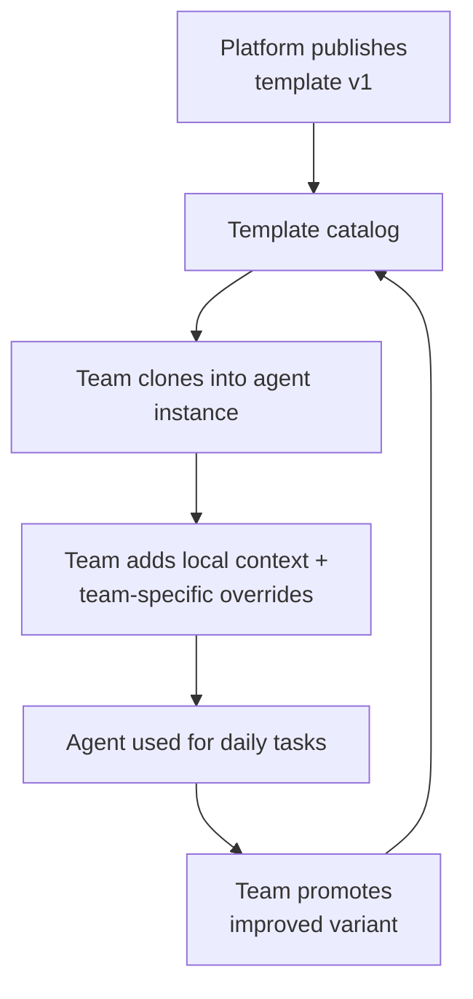

# Agent Templates

**Pillar:** Knowledge Flow · **Audience:** 🤝 Both

Pre-configured agent definitions (role, default context, skill references, sensor chain, MCP tool allow-list). Platform publishes, teams clone and customize, successful variants get promoted back.

---

## Where it sits

Sits above Skill Library and Context Hub. A template is a **recipe for an agent instance** — it references skills by name (resolved through Skill Library) and declares which context layers and sensors to use. Cloning a template creates a concrete agent attached to a team and project.

## Depends on

- **Skill Library** — templates reference skills by name + version pin
- **Context Hub** — templates declare which context layers they require
- **MCP Tool Governance** — templates declare which tools their agents may use
- **Audit Log** — every template version + every clone is logged

## Workflow

## Interfaces

- **Web UI** — browse catalog, clone, customize, promote variant
- **REST API** — CRUD, clone, version pin, dependency resolution
- **Template manifest** — declarative spec (skills, context layers, sensors, tools, defaults)
- **Update propagation** — instances opt in to "track latest" or pin to a version

## See also

- [Skill Library]({{ site.baseurl }})
- [Context Hub]({{ site.baseurl }})
- [MCP Tool Governance]({{ site.baseurl }})
