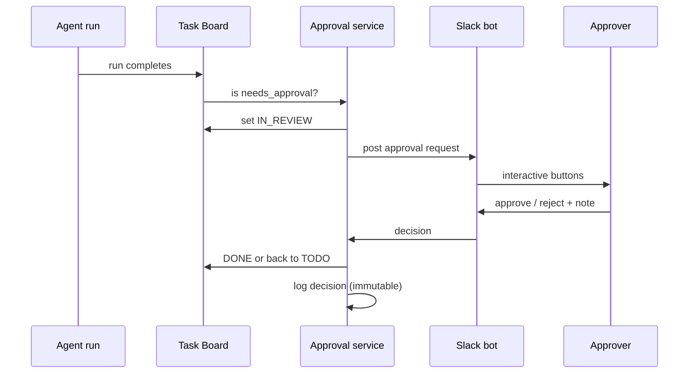

# Approval Workflow

**Pillar:** Task Tracking · **Audience:** 🤝 Both

Tasks flagged `needs_approval` stop at In Review until a human approves. Every decision is logged with who, when, and rationale. Rejections re-queue the task with feedback.

---

## Where it sits

Sits between the agent run and the task lifecycle transition. When a task is flagged, the run completes into `IN_REVIEW` instead of `DONE`. Approval decisions move the task forward or back.

## Depends on

- **Task Board** — owns the task state machine
- **Audit Log** — approval decisions are immutable audit entries
- **Integration Surface** — Slack bot for in-channel approvals

## Workflow

## Interfaces

- **Web UI** — review queue, task detail with full context/diff, approve/reject actions
- **Slack** — interactive approval messages with buttons
- **REST API** — list pending, submit decision, query history
- **Compliance export** — all decisions as structured data

## See also

- [Task Board]({{ site.baseurl }})
- [Audit Log]({{ site.baseurl }})
