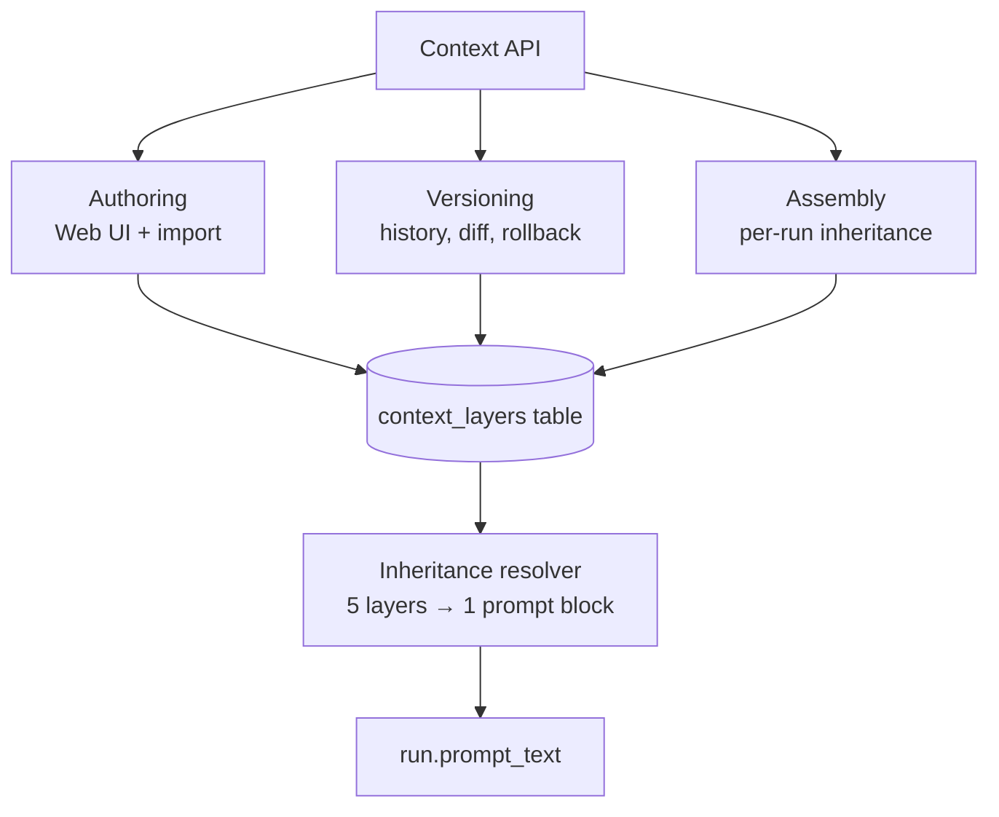
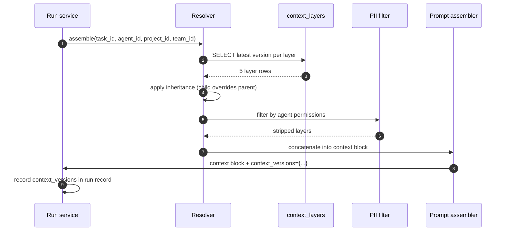
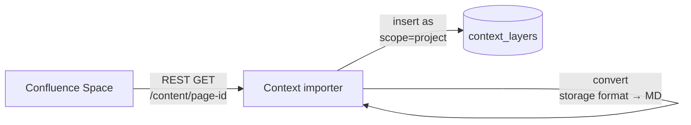
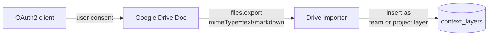
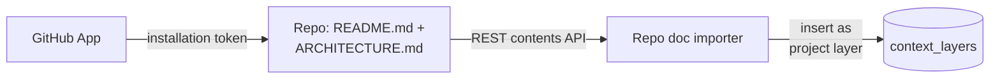

# Context Hub

## Purpose

Inject the right context into every agent run. Lifted from per-laptop CLAUDE.md to organizational shared, versioned, inheritable. The 5 layers (Company → Project → Team → Agent → Task) cascade automatically so engineers never paste a policy into a prompt again, and leadership has one place to update org-wide standards.

## Architecture



## Data model

```sql
CREATE TABLE context_layers (
  id              TEXT PRIMARY KEY,
  scope           TEXT NOT NULL,  -- 'company'|'project'|'team'|'agent'|'task'
  scope_id        TEXT NOT NULL,
  content         TEXT NOT NULL,
  version         INTEGER NOT NULL,
  parent_version  INTEGER,
  pii_tags        TEXT,           -- JSON array
  owner_id        TEXT NOT NULL,
  created_at      DATETIME NOT NULL
);
CREATE INDEX idx_context_scope ON context_layers(scope, scope_id, version);
```

## Processing flow



## Ecosystem integration

The Context Hub imports from your existing knowledge bases. **Read-only**, scheduled or on-demand. Imported content is tagged with source so it can be re-pulled.

### Confluence



| Confluence | Dandori |
|---|---|
| Space | Project |
| Page | Context layer source |
| Labels | PII tags + classification |
| Version history | Context Hub version history |

**Auth:** Confluence Cloud API token; on-prem uses Personal Access Token.

### Google Drive (already shipped)



**Auth:** OAuth2 with refresh tokens. Per-user consent for read-only Drive scope. Tokens encrypted at rest.

### GitHub Enterprise



Auto-import per repo, configurable. Triggered by webhook on README change.

## Version diff — auditing what changed

Every layer edit creates a new version row. Engineers and leadership can inspect the delta.

```
$ dandori context diff company v11 v12

--- company v11 (2026-03-01, by: security-lead)
+++ company v12 (2026-03-15, by: security-lead)

  # Company-wide coding standards
  - Use TypeScript 5.2+
  + Use TypeScript 5.3+

  # PII handling
  + All PII fields must be tagged with @pii annotation
  + Logs must call PiiVault.scrub() before emission
```

Web UI: Context Hub → layer history → click version to see diff and rollback button. Every diff view is recorded in the audit log (who looked at what, when).

---

## Tech specifics

- TypeScript service + SQLite tables
- Diff via simple line-based comparison (no Git dependency)
- Re-import is idempotent (source-tagged rows are upserted by source ID)
- PII filter is policy-driven; agent must have explicit permission to see PII-tagged layers

## See also

- [Skill Library]({{ site.baseurl }}) — the other "guides" module
- [Audit Log]({{ site.baseurl }}) — every context version edit is recorded
- [Use Case Flow 4 — Copilot context query]({{ site.baseurl }}#flow-4-engineer-asks-copilot-a-context-aware-question)
