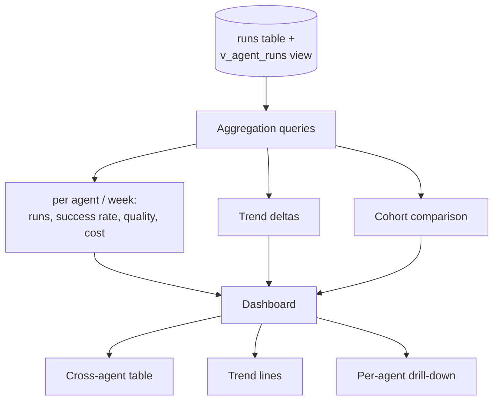
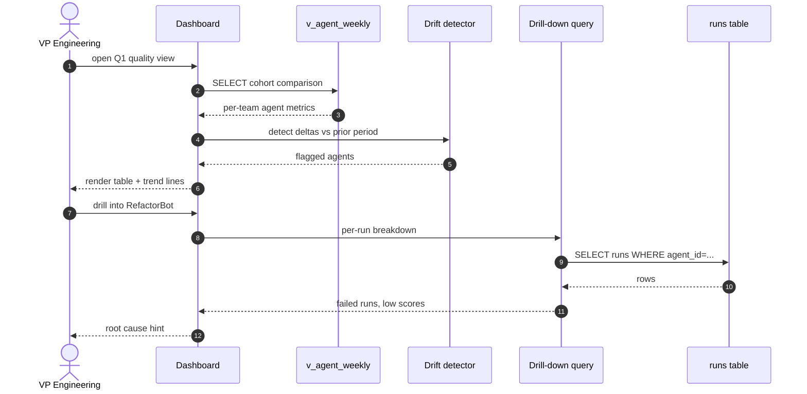
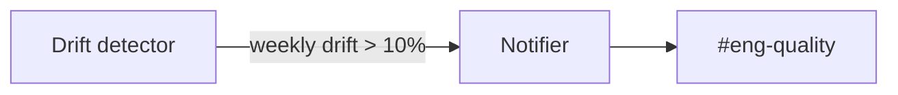

# Cross-agent Analytics

## Purpose

Vendor dashboards show aggregate tokens. Leadership needs to ask "which agent is most cost-effective?" or "is Team B's quality drifting?" — these queries are impossible without per-agent metadata. Dandori already records that metadata; this module exposes it as dashboards and trend lines.

## Architecture



## Data model

Reads from existing `runs` table + `v_agent_runs` view. No new tables — just SQL views and aggregations.

```sql
CREATE VIEW v_agent_weekly AS
SELECT
  agent_id,
  strftime('%Y-W%W', started_at) AS week,
  COUNT(*)                       AS run_count,
  AVG(quality_score)             AS avg_quality,
  SUM(cost_usd)                  AS total_cost,
  AVG(CASE WHEN exit_code=0 THEN 1.0 ELSE 0.0 END) AS success_rate
FROM v_agent_runs
GROUP BY agent_id, week;
```

## Processing flow



## Sample dashboard query

```sql
-- Top 10 agents by cost / quality ratio
SELECT
  agent_id,
  SUM(cost_usd) AS spend,
  AVG(quality_score) AS quality,
  SUM(cost_usd) / NULLIF(AVG(quality_score), 0) AS dollars_per_quality
FROM v_agent_runs
WHERE started_at > date('now', '-30 days')
GROUP BY agent_id
ORDER BY dollars_per_quality DESC
LIMIT 10;
```

## Use cases

- **Cost-per-quality ratio** ranking
- **Quality drift** detection (vs prior 7-day average)
- **Cohort comparison** (Team A vs Team B agents on same task type)
- **Phase breakdown** (which phase burns most for an agent)
- **Top-cost tasks** (where is spend going)

## Ecosystem integration

### Slack



Weekly digest of drifted agents posted to `#eng-quality`.

### Email

Monthly executive summary auto-generated.

### Datadog / Grafana (roadmap)

Optional: export aggregations as Prometheus metrics for unified org dashboarding.

## Tech specifics

- All metrics computed via SQL views, no aggregation pipeline
- For team scale: views run in &lt;1s on SQLite
- For enterprise scale: materialized views or read replica with hourly refresh
- Drift detection is a simple delta comparison; ML-based anomaly detection deferred to a Python sidecar (see Node.js vs Python tradeoff)

## See also

- [Quality Gates]({{ site.baseurl }}) — produces quality scores consumed here
- [Cost Attribution]({{ site.baseurl }}) — produces cost data consumed here
- [Use Case Flow 5 — Cost review]({{ site.baseurl }}#flow-5-leadership-monthly-cost-review)
