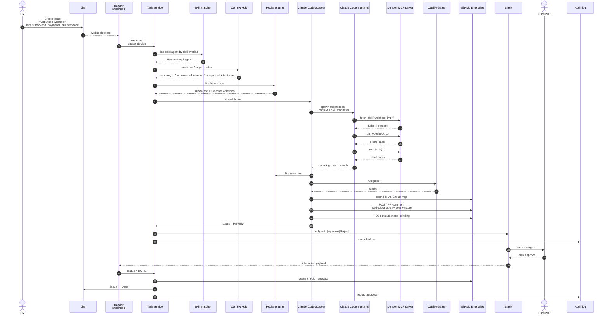
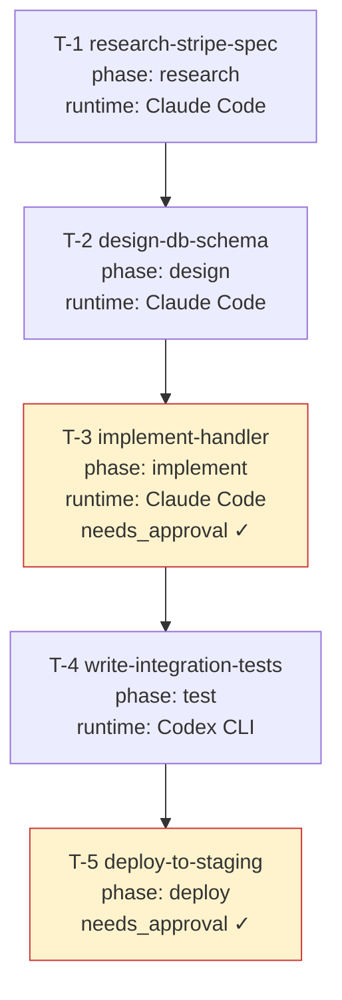
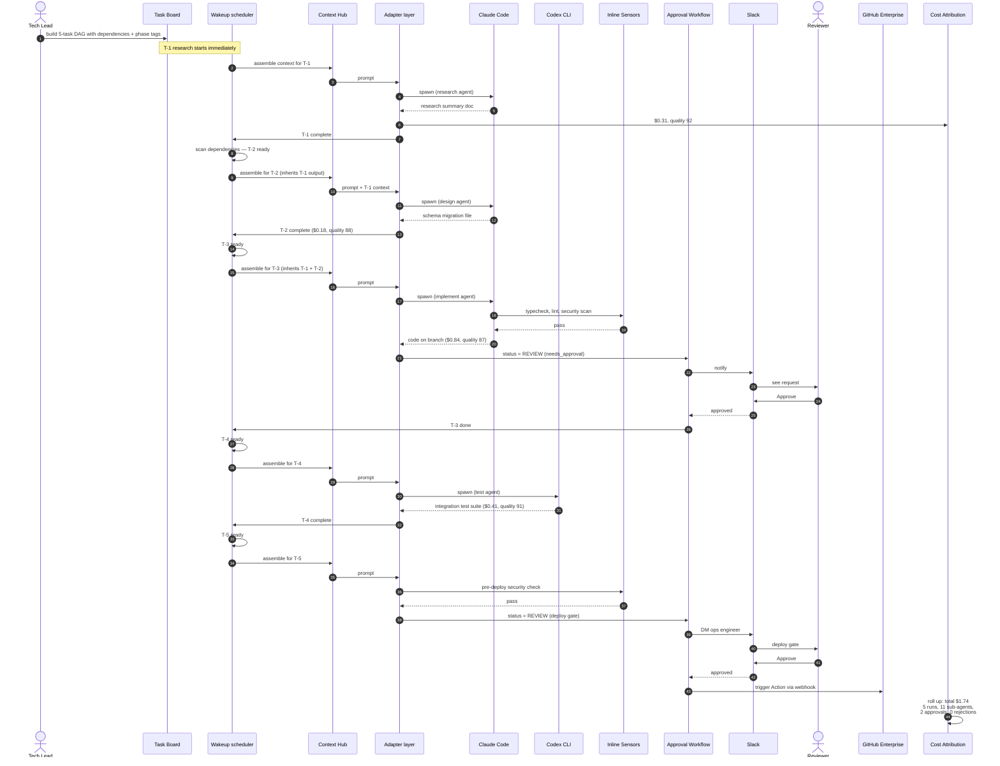
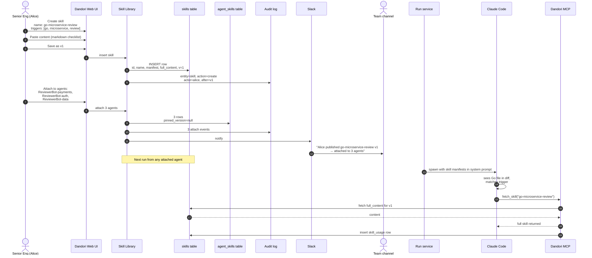
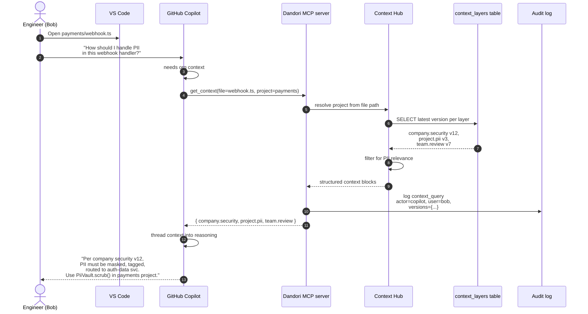
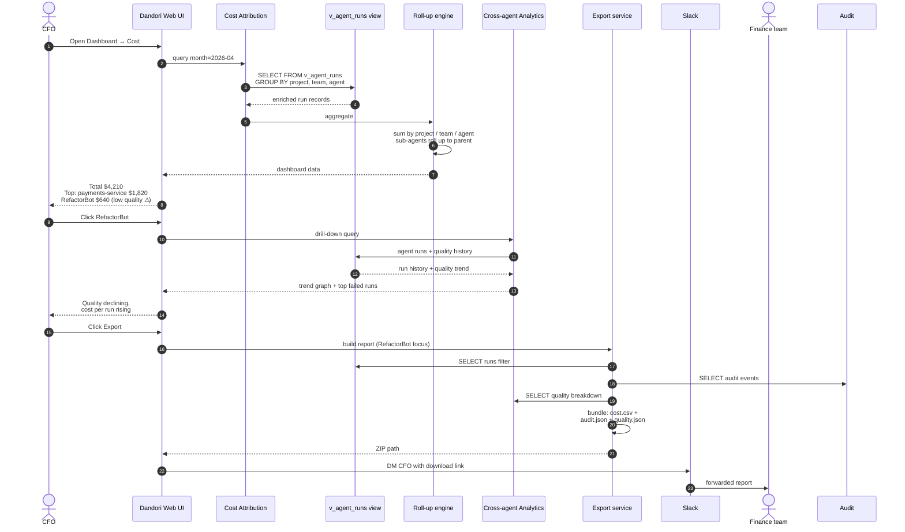
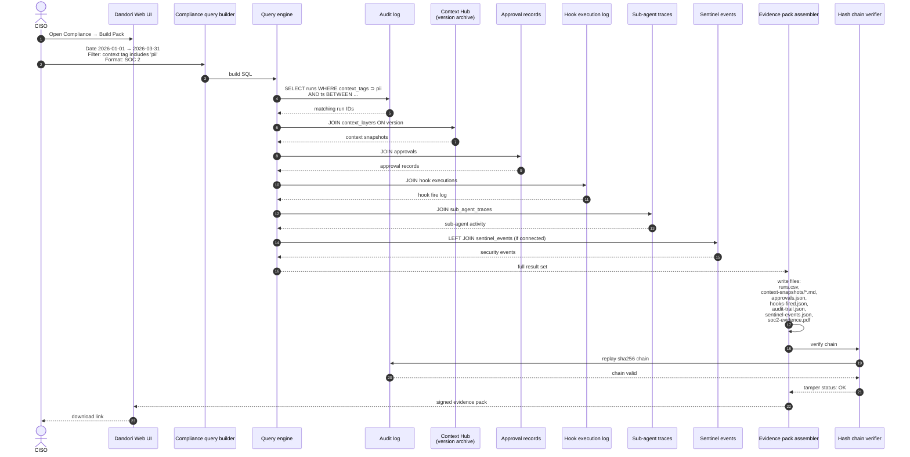

# Use Case Flows

End-to-end processing flows for the most common scenarios when a team pilots Dandori with their existing tools (Claude Code, Codex, Copilot, Jira, Confluence, GitHub Enterprise, Google Drive, Slack).

Each flow is rendered as a Mermaid sequence diagram or flowchart showing the modules and integrations involved.

---

## Flow 1: Jira issue → agent run → PR with audit

**Scenario:** PM creates a Jira issue. Dandori picks it up automatically, an agent implements it, opens a PR, posts a self-explanation comment, and waits for human approval.

**Modules touched:** Task Board, Skill Library (matching), Context Hub, Hooks, Claude Code adapter, Inline Sensors, Quality Gates, Approval Workflow, Audit Log, Cost Attribution

**Integrations:** Jira (in), GitHub Enterprise (out), Slack (out + in)

**Outcome:** Issue → PR → human approval → merge — all traceable, costed, audited.

---

## Flow 2: Multi-phase feature DAG

**Scenario:** Tech lead breaks a feature into a 5-task DAG covering research → design → implement → test → deploy. Each phase auto-wakes when its dependency completes.

### DAG topology

### Sequence with auto-wakeup and approvals

**Modules touched:** Task Board (DAG), Context Hub (inheritance + task chain), Skill Library, Inline Sensors (sensor chain), Approval Workflow, Sub-agent Trace, Cost Attribution (roll-up), Audit Log

**Integrations:** Confluence (in), Claude Code, Codex CLI, Slack (notify + approve), GitHub Enterprise (deploy webhook)

**Outcome:** Feature shipped end-to-end with no manual handoffs between phases.

---

## Flow 3: Engineer publishes a team skill

**Scenario:** Senior engineer turns a proven prompt pattern into a versioned skill that all team agents inherit.

**Modules touched:** Skill Library, Audit Log

**Integrations:** Slack (notify)

**Outcome:** Knowledge becomes org asset, not personal notes. Every attached agent picks up updates automatically. Usage analytics show which skills actually get fetched.

---

## Flow 4: Engineer asks Copilot a context-aware question

**Scenario:** Engineer in VS Code asks Copilot a question. Copilot calls Dandori MCP server to ground its answer in team standards.

**Modules touched:** Context Hub, MCP Server, Audit Log

**Integrations:** GitHub Copilot (in via MCP)

**Outcome:** Engineer gets a grounded answer. Dandori logs which engineer queried which context, when, for which file. Compliance team can answer "did engineers see the security policy when they wrote this code?"

---

## Flow 5: Leadership monthly cost review

**Scenario:** CFO opens Dandori dashboard at month-end. Sees full breakdown, drills into anomalies, exports report.

**Modules touched:** Cost Attribution, Cross-agent Analytics, Audit Log

**Integrations:** Slack (deliver report)

**Outcome:** Leadership has actionable cost data without engineering involvement.

---

## Flow 6: Compliance audit "show me PII-touching runs in Q1"

**Scenario:** CISO needs to produce evidence for a SOC 2 audit. Filters audit log + context versions + Sentinel events + approval records.

**Modules touched:** Audit Log, Context Hub (version archive), Approval Workflow, Sub-agent Trace, Hooks (execution log), Compliance Export

**Integrations:** None — entirely internal

**Outcome:** Auditor receives signed, tamper-evident evidence pack in minutes instead of weeks.

---

## Flow summary table

| # | Scenario | Trigger | Key modules | Ecosystem | Outcome |
|---|---|---|---|---|---|
| 1 | Jira → PR → approval | Jira webhook | Task, Context, Hooks, Adapter, Sensors, Approval, Audit | Jira, GH, Slack | Auto PR with audit |
| 2 | Multi-phase DAG | Tech lead builds DAG | Task DAG, Context inheritance, Sensors chain, Sub-agent trace, Approval | Confluence, Claude Code, Codex, Slack, GH | Feature shipped without handoffs |
| 3 | Publish team skill | Senior engineer | Skill Library, Audit | Slack | Knowledge becomes org asset |
| 4 | Copilot context query | Engineer in IDE | Context Hub, MCP, Audit | Copilot | Grounded IDE answer |
| 5 | Cost review | CFO opens dashboard | Cost, Analytics, Audit | Slack | Actionable cost data |
| 6 | Compliance pack | CISO triggers | Audit, Context archive, Approval, Hooks, Compliance Export | None | Audit evidence in minutes |

---

## See also

- [Architecture Overview]({{ site.baseurl }}) — System architecture, tech stack, deployment topologies
- [Modules]({{ site.baseurl }}) — Per-module pages with diagrams, data model, and ecosystem integration
- [Use Cases]({{ site.baseurl }}) — Higher-level business scenarios that drive these flows
