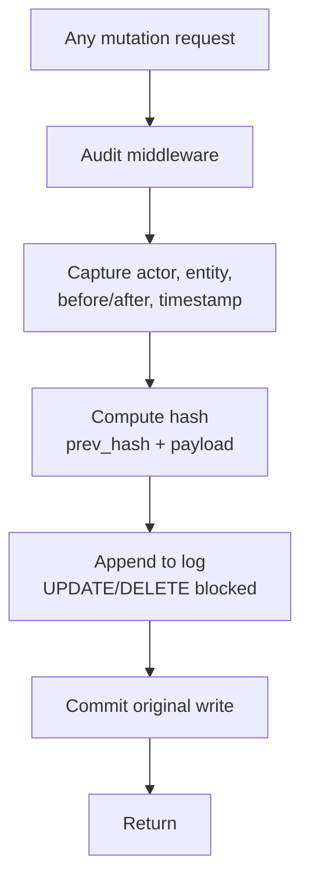

# Audit Log

**Pillar:** Audit & Analytics · **Audience:** 🧭 Leadership

Every mutation in Dandori flows through a middleware that writes an immutable record: actor, timestamp, entity, before/after. Append-only at the database level. Optional hash chain for tamper-evidence.

---

## Where it sits

Foundation module. Every write path (REST API, CLI, MCP, webhook ingress) passes through audit middleware before committing. A run's lifecycle (context inject → hook → adapter → gate → approval) also emits audit events.

## Depends on

- **Integration Surface** — the middleware hooks into every write endpoint

## Workflow

## Interfaces

- **REST API** — query by actor, entity, date range, action type
- **Compliance export** — JSON / CSV / SOC 2 format, one-click
- **Retention policy** — hot 365d default + cold archive, configurable per project
- **Verification** — recompute hash chain to detect tampering

## See also

- [Cross-agent Analytics]({{ site.baseurl }})
- [Sub-agent Trace]({{ site.baseurl }})
