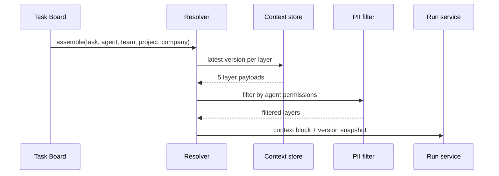

# Context Hub

**Pillar:** Knowledge Flow · **Audience:** 🤝 Both

Assemble a 5-layer versioned context hierarchy (Company → Project → Team → Agent → Task) into every agent prompt.

---

## Where it sits

Runs between Task Board and the adapter layer. When a run is triggered, the resolver walks the 5 layers, applies PII filters, and emits a single context block plus a version snapshot recorded on the run.

## Depends on

- **Integration Surface** — Web UI and API for authoring
- **Audit Log** — every edit and every rollback is logged
- **Adapter layer** — consumes the assembled context block

## Workflow

## Interfaces

- **Web UI** — per-layer editor, diff view, rollback, PII tagging
- **REST API** — CRUD + version history
- **MCP tool** — `fetch_context` for agents that want targeted lookup
- **Importers** — Confluence, Google Drive, GitHub README (read-only, source-tagged)

## See also

- [Skill Library]({{ site.baseurl }})
- [Agent Templates]({{ site.baseurl }})
- [Audit Log]({{ site.baseurl }})
