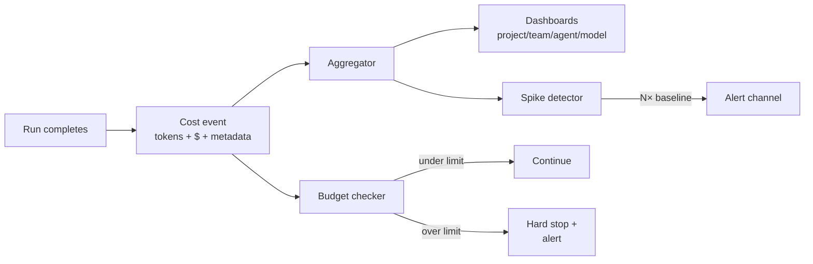

# Cost Attribution

**Pillar:** Cost Attribution · **Audience:** 🧭 Leadership

Log every run's cost with full metadata, break it down by any dimension, enforce budget ceilings, alert on spikes.

---

## Where it sits

Sits immediately after the adapter layer. Every completed run emits a cost event with token counts and metadata. Cost Attribution stores, aggregates, and exposes these for dashboards, alerts, and hard stops.

## Depends on

- **Adapter layer** — runs emit cost events on completion
- **Task Board** — supplies task/project/team metadata for attribution
- **Audit Log** — cost events are also written to the audit stream

## Workflow

## Interfaces

- **Web UI** — dashboards with drilldowns (project → team → agent → run)
- **REST API** — query, export CSV/JSON
- **Budget config** — per-agent, per-project ceilings with soft/hard thresholds
- **Alert sinks** — Slack, webhook

## See also

- [Cross-agent Analytics]({{ site.baseurl }})
- [Audit Log]({{ site.baseurl }})
