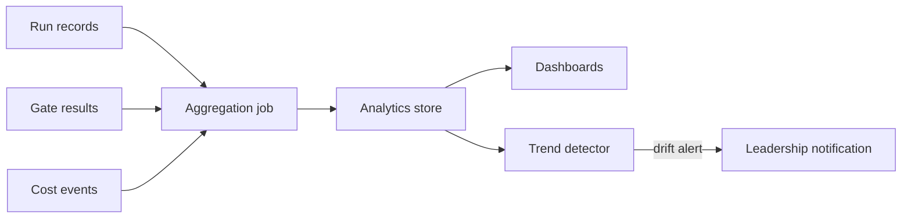

# Cross-agent Analytics

**Pillar:** Audit & Analytics · **Audience:** 🧭 Leadership

Per-agent, per-team, and per-model KPIs: success rate, quality score, cost per run, duration, phase breakdown. Trend detection (improving vs degrading). Controlled experiments for model eval.

---

## Where it sits

Consumer of the data the other pillars produce. Doesn't write — reads from run records, cost events, gate results, audit log. Runs aggregation jobs on a schedule.

## Depends on

- **Cost Attribution** — cost per run + attribution metadata
- **Quality Gates** — quality score per run
- **Adapter layer** — run duration, success/failure
- **Audit Log** — aggregate query source

## Workflow

## Interfaces

- **Web UI** — agent comparison table, trend charts, phase breakdowns
- **REST API** — query KPIs, export
- **Scheduled jobs** — rebuild aggregates nightly
- **Eval mode** — route matched tasks to multiple agents for comparison

## See also

- [Quality Gates]({{ site.baseurl }})
- [Cost Attribution]({{ site.baseurl }})
