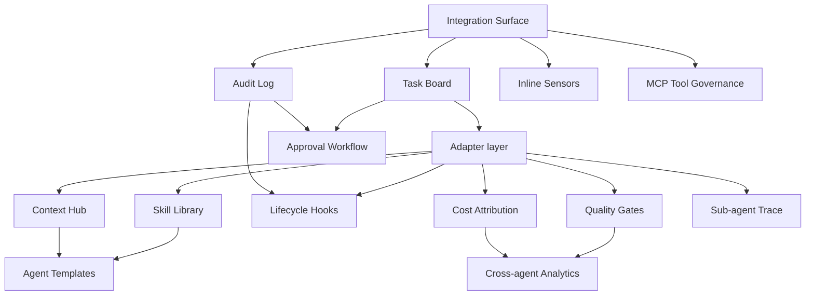

# Module Specs

Basic design for each of Dandori's 14 modules. Each page follows the same shape: **where it sits · depends on · workflow · interfaces**. No code, no schemas — just enough to understand the boundary and wire it up.

---

## Pillar 1 — Cost Attribution

- [Cost Attribution]({{ site.baseurl }})

## Pillar 2 — Multi-layer Knowledge Flow

- [Context Hub]({{ site.baseurl }})
- [Skill Library]({{ site.baseurl }})
- [Agent Templates]({{ site.baseurl }})

## Pillar 3 — Task Tracking

- [Task Board]({{ site.baseurl }})
- [Approval Workflow]({{ site.baseurl }})
- [Lifecycle Hooks]({{ site.baseurl }})

## Pillar 4 — Quality Gates

- [Quality Gates]({{ site.baseurl }})
- [Inline Sensors]({{ site.baseurl }})

## Pillar 5 — Audit & Analytics

- [Audit Log]({{ site.baseurl }})
- [Cross-agent Analytics]({{ site.baseurl }})
- [Sub-agent Trace]({{ site.baseurl }})
- [MCP Tool Governance]({{ site.baseurl }})

## Foundation

- [Integration Surface]({{ site.baseurl }})

---

## Dependency overview

