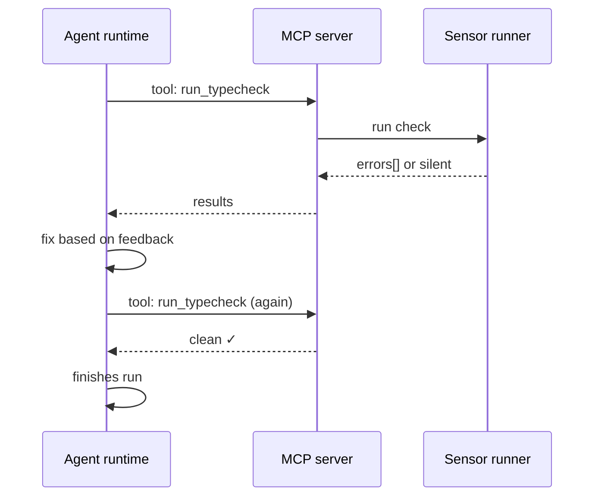

# Inline Sensors

**Pillar:** Quality Gates · **Audience:** 👷 Engineers

Sensors the agent can call **during** a run via MCP tools (`run_typecheck`, `run_lint`, `run_security_scan`, etc.). Silent on success, verbose on error. Lets the agent self-correct before finishing — not after.

---

## Where it sits

Runs alongside the agent runtime as MCP tools the runtime invokes when the agent decides to call them. The agent gets the output back as tool results and iterates.

## Depends on

- **Integration Surface** — built-in MCP server hosts the sensor tools
- **Quality Gates** — reuses the same underlying checks (typecheck, lint, etc.)
- **MCP Tool Governance** — sensor tools are allow-listed per agent

## Workflow

## Interfaces

- **MCP tools** — `run_typecheck`, `run_lint`, `run_tests`, `run_security_scan`, and custom sensors
- **Sensor registry** — org-wide sensor definitions, per-project overrides
- **Two sensor types** — computational (fast, ms) and inferential (LLM-powered, slower)
- **Chain config** — task types can require specific sensor chains (e.g., "migrations must pass schema-match sensor")

## See also

- [Quality Gates]({{ site.baseurl }})
- [MCP Tool Governance]({{ site.baseurl }})
