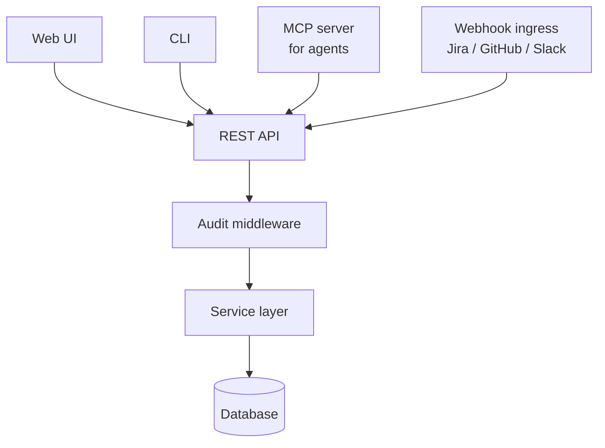

# Integration Surface

**Foundation** · **Audience:** 👷 Engineers

Same operations available through four interfaces — Web UI, REST API, CLI, built-in MCP server — plus webhook ingress for external systems. Every interface hits the same service layer and the same audit middleware.

---

## Where it sits

The outermost boundary. Foundation module — everything else is reached through it. Auth (API keys → SSO/OIDC), rate limits, and audit middleware all live here.

## Depends on

- (Foundation — nothing below it)

## Workflow

## Interfaces

- **Web UI** — primary workspace for engineers and leadership
- **REST API** — OpenAPI 3.0 spec; autogenerated clients for any language
- **CLI** — scripting, CI/CD integration, terminal workflows
- **MCP server** — Dandori's own operations exposed as MCP tools so Claude Code / Codex / Copilot can talk to Dandori from inside the IDE
- **Webhook ingress** — Jira issues → tasks, GitHub PR events → run triggers, Slack interactive approvals

## Interface choice guide

| Use case | Best interface |
|---|---|
| Daily authoring (context, skills, tasks) | Web UI |
| CI/CD integration | REST + webhooks |
| Terminal-heavy engineers | CLI |
| Agent-to-Dandori communication | MCP |
| External tool sync | Webhook ingress |

## See also

- [Module Specs index]({{ site.baseurl }})
