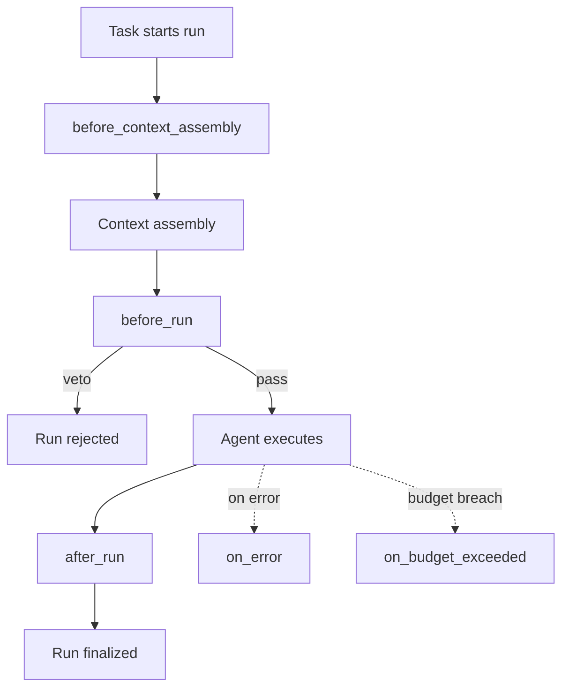

# Lifecycle Hooks

**Pillar:** Task Tracking · **Audience:** 👷 Engineers

Register sandboxed scripts that fire at `before_context_assembly`, `before_run`, `after_run`, `on_error`, `on_budget_exceeded`, `on_approval_request`. Platform can mandate org-wide hooks (e.g., "all payment runs must log PII check").

---

## Where it sits

Wraps the adapter layer. Hooks can mutate or veto the prompt before a run, react to results after, or fire on error/budget breach. Hooks are treated as versioned config, not ad-hoc code.

## Depends on

- **Adapter layer** — hook points are invoked around each run
- **Context Hub** — `before_context_assembly` can filter/enrich layers
- **Audit Log** — every hook execution is logged (exit code, duration, output)

## Workflow

## Interfaces

- **Web UI** — register, version, enable/disable, view execution history
- **REST API** — CRUD, trigger test run, query execution logs
- **Script runner** — sandboxed subprocess with timeout; input/output as JSON
- **Scope config** — org-wide, per-project, or per-agent

## See also

- [Task Board]({{ site.baseurl }})
- [Audit Log]({{ site.baseurl }})
