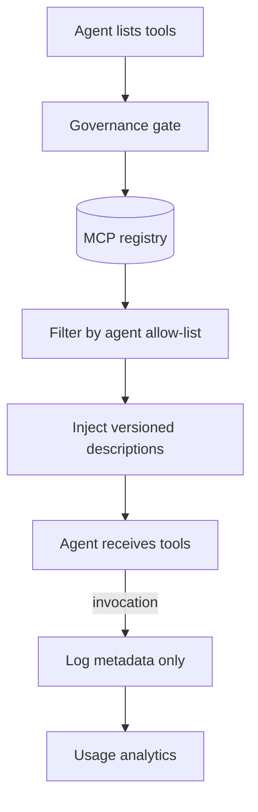

# MCP Tool Governance

**Pillar:** Audit & Analytics · **Audience:** 🤝 Both

Dandori does not **host** MCP servers (that's MCP Hub's job). Dandori **governs** them: org-wide registry, per-agent and per-team allow-lists, description versioning and linting, usage analytics across the fleet.

---

## Where it sits

Sits between agents and the MCP servers they use. When an agent lists tools, Dandori filters by the agent's allow-list and injects versioned descriptions. Tool call metadata is logged for analytics (not arguments or results).

## Depends on

- **Integration Surface** — Dandori's own MCP server is governed alongside external servers
- **Agent Templates** — templates declare which tools an instance may use
- **Audit Log** — allow-list changes and governance actions are audit events

## Workflow

## Interfaces

- **Web UI** — registry, per-agent allow-lists, description editor with diff
- **REST API** — register MCP server, manage allow-lists, query usage
- **Description lints** — flag bloated (> N tokens), duplicate, ambiguous
- **Usage analytics** — top tools by context consumption, unused tools

## See also

- [Agent Templates]({{ site.baseurl }})
- [Inline Sensors]({{ site.baseurl }})
