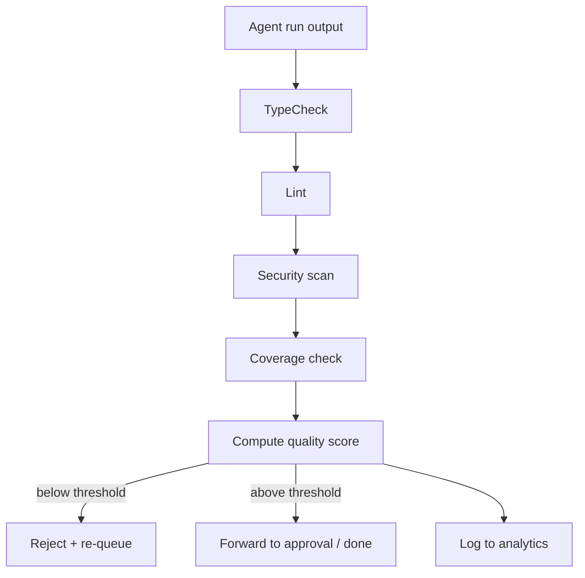

# Quality Gates

**Pillar:** Quality Gates · **Audience:** 🤝 Both

Run a pipeline of independent checks on every agent output: typecheck, lint, security scan, coverage. Produces a quality score per run. Trend analytics per agent, team, phase, and time window.

**Why independent:** Separation of Duties. Inner Harness TDD loop runs *inside* the agent — the agent can skip tests to finish faster. Outer gates run *after*, outside the agent's control.

---

## Where it sits

Sits between the agent run and downstream consumers (approval queue, analytics). A run's output is not considered "done" until gates complete.

## Depends on

- **Adapter layer** — runs expose their output artifacts
- **Lifecycle Hooks** — `after_run` invokes the gate pipeline
- **Audit Log** — every gate result is an audit event

## Workflow

## Interfaces

- **Web UI** — per-run gate results, per-team/per-agent trend charts
- **REST API** — gate config, query results, export trends
- **Gate registry** — org-wide and per-project pipelines
- **Score rule** — configurable thresholds per project

## See also

- [Inline Sensors]({{ site.baseurl }})
- [Cross-agent Analytics]({{ site.baseurl }})
