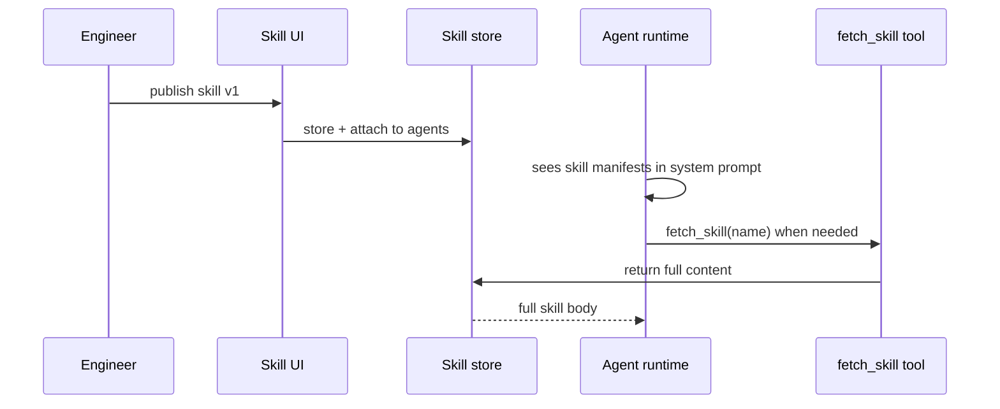

# Skill Library

**Pillar:** Knowledge Flow · **Audience:** 👷 Engineers (leadership as owner)

Versioned, shareable prompt knowledge (review checklists, migration recipes, incident runbooks). Attached many-to-many to agents. Lazy-loaded via `fetch_skill` to save tokens.

---

## Where it sits

Sits alongside Context Hub as the second Knowledge Flow asset. Only skill manifests (name, description, trigger) are injected upfront; full content is fetched on demand when the agent actually calls the skill.

## Depends on

- **Integration Surface** — exposes the `fetch_skill` MCP tool
- **Context Hub** — shares the same 5-layer ownership model for who can publish at which level
- **Audit Log** — every skill version and attachment is logged

## Workflow

## Interfaces

- **Web UI** — author, version, attach to agents, browse library
- **REST API** — CRUD, version history, attachment management
- **MCP tool** — `fetch_skill(name)` for lazy loading
- **Promote flow** — bottom-up submit + review + publish to higher layer

## See also

- [Context Hub]({{ site.baseurl }})
- [Agent Templates]({{ site.baseurl }})
