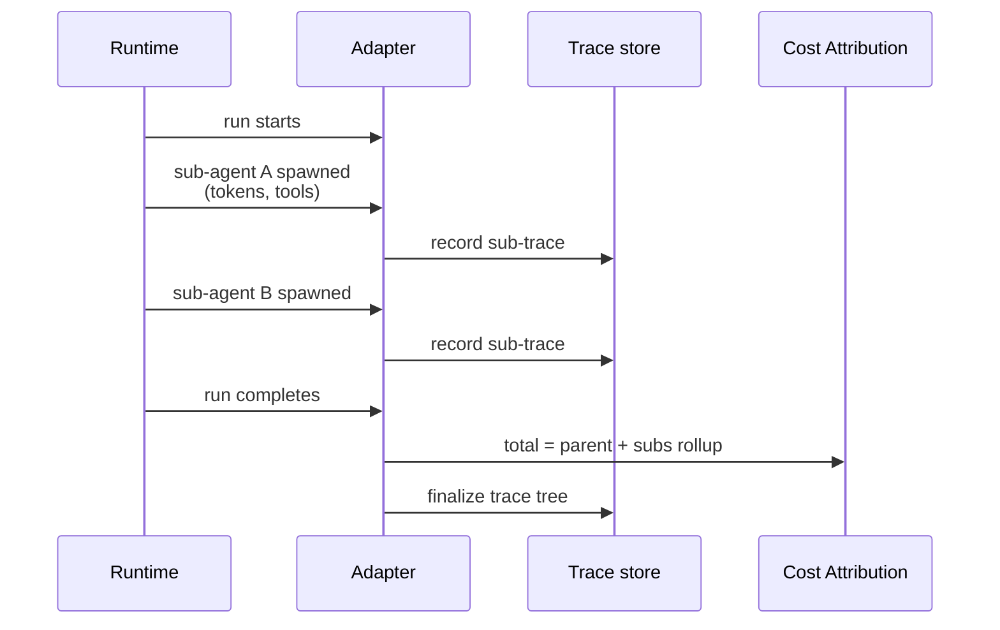

# Sub-agent Trace

**Pillar:** Audit & Analytics · **Audience:** 🤝 Both

Modern runtimes (Claude Code, LangGraph) spawn sub-agents internally. Dandori **does not spawn** them — that's the inner harness. Dandori **observes** them via an adapter protocol extension: tokens, duration, tool calls, cost — rolled up to the parent run.

---

## Where it sits

Extends the adapter layer. When a runtime supports sub-agent reporting, the adapter collects traces during the run and attaches them to the run record. Cost rolls up: sub-agent → parent run → task → project.

## Depends on

- **Adapter layer** — protocol extension to receive sub-agent events
- **Cost Attribution** — rollup destination for sub-agent costs
- **Audit Log** — policy violations (depth limit, disallowed tools) are audit events

## Workflow

## Interfaces

- **Web UI** — expandable run view showing sub-agent tree
- **REST API** — query by parent run, filter by tool, depth
- **Policies** — max depth, tool restrictions, token budget per sub-agent
- **Adapter protocol** — optional extension; runtimes that don't support it fall back to single-level traces

## See also

- [Cost Attribution]({{ site.baseurl }})
- [Audit Log]({{ site.baseurl }})
