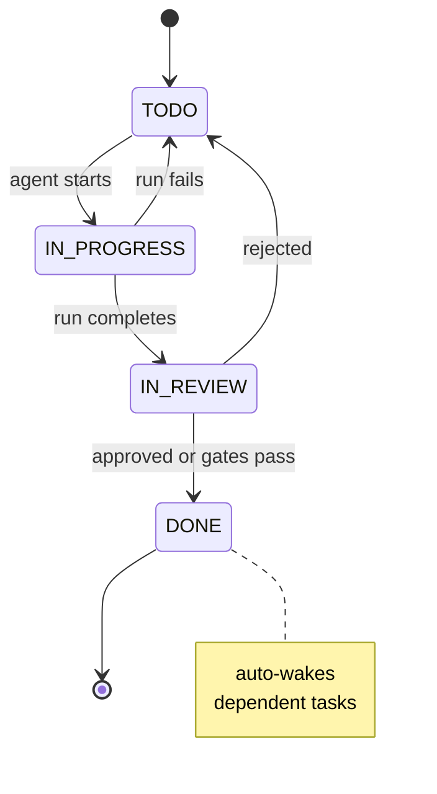
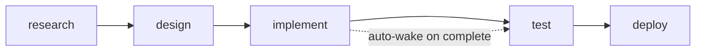

# Task Board

**Pillar:** Task Tracking · **Audience:** 👷 Engineers

Tasks are the root entity for runs, approvals, cost, and quality. Supports phase tags, DAG dependencies with cycle prevention, auto-wakeup on parent completion, and skill-based agent suggestions.

---

## Where it sits

One of the four foundation modules. Nothing else has data until tasks exist. A task ties together: the context assembled for its run, the agent that ran it, the cost it accrued, and the approval/quality records attached.

## Depends on

- **Integration Surface** — CRUD via UI/API/CLI
- **Audit Log** — every status change + dependency edit is logged
- **Skill Library** — skill tags on tasks drive agent suggestions

## Workflow

## Interfaces

- **Web UI** — board view, DAG visualizer, phase portfolio, task detail
- **REST API + CLI** — full CRUD, dependency management, status changes
- **Webhook ingress** — Jira issues become tasks automatically
- **MCP tool** — `create_task`, `update_task_status` for agents to manage their own work

## See also

- [Approval Workflow]({{ site.baseurl }})
- [Lifecycle Hooks]({{ site.baseurl }})
