# Workflows

How the features from [Dandori Overview]({{ site.baseurl }}) actually get used. Each scenario is a sequence diagram showing which Dandori components interact in a real workflow.

---

## Leadership scenarios

### CFO: "Where did the AI bill go?"

Opens Cost Attribution dashboard. Drills from total spend → top project → top agent by cost-to-quality ratio. Spots an outlier burning far above baseline at low quality. Action: investigate the outlier, shift low-complexity work to a cheaper model. **Minutes, not meetings.** Before Dandori: "we'll ask the teams" → spreadsheet next week.

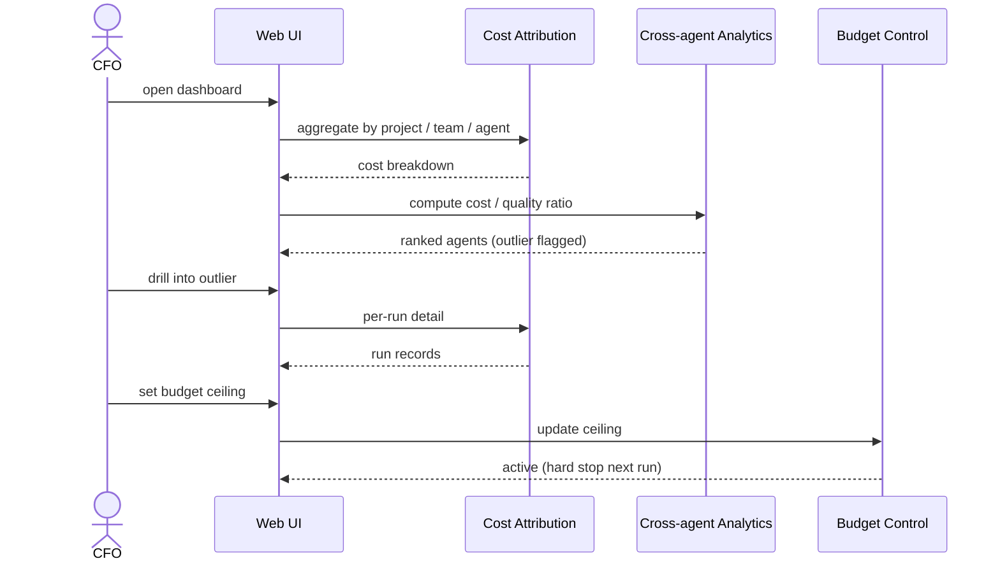

### Platform VP: morning fleet check

Opens Fleet Operations Dashboard at stand-up. Sees live view: 23 agents active across 6 teams, total burn rate $4.2/min, owner mapping per agent. One agent flagged red — duration 40 min vs usual 12. Drills in: stuck on a dependency loop. Action: ping the owning team in Slack.

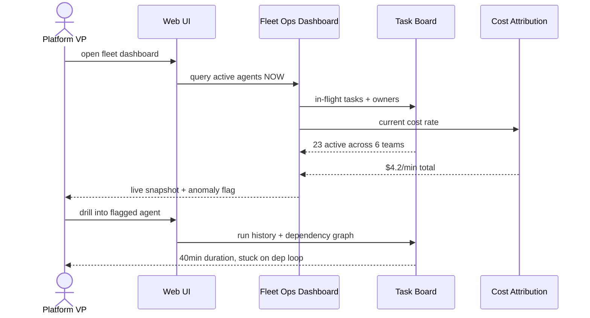

### Platform lead: 8 teams, one standard

Sets Company context (Layer 1): security rules, approved libraries, style guide. Publishes shared skills and agent templates. All 8 teams inherit automatically; each still owns its project + team context. Cross-team analytics spot best practices and flag outliers.

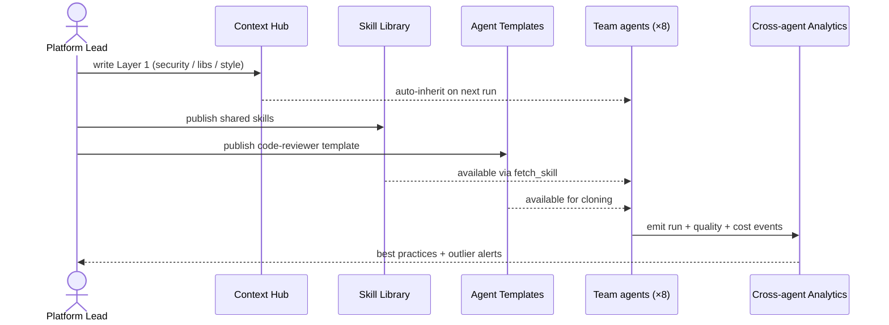

### CISO: "Show me PII-touching runs in Q1"

Queries audit log: runs where context contained PII-tagged layers, date range Q1. Result set with full context versions per run. One-click compliance export (JSON / CSV / SOC 2 format).

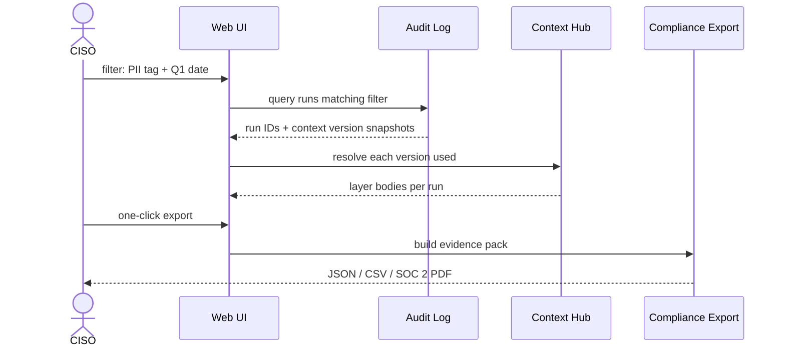

### Engineering Director: quality trending

Dashboard shows company quality trend + per-team breakdown. One team is drifting downward. Drill down: specific agent's score dropped — root cause: outdated skill version. Action: Platform team updates the skill, change propagates to every attached agent.

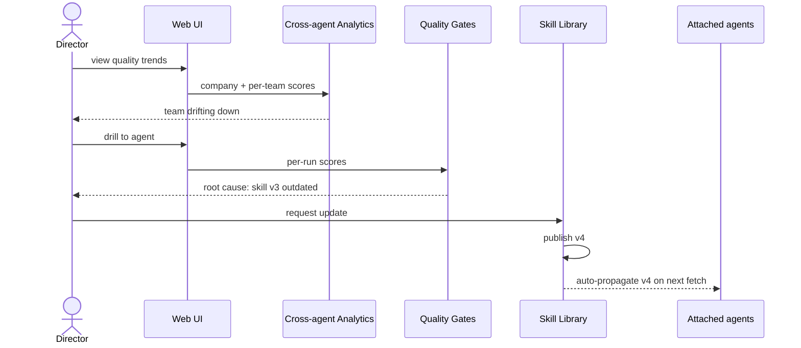

### Compliance: SOC 2 audit prep

One-click evidence pack: access control, change management, audit trail, data classification, policy enforcement, incident traceability. All the controls an auditor asks about, already logged. Before Dandori: a custom tooling project.

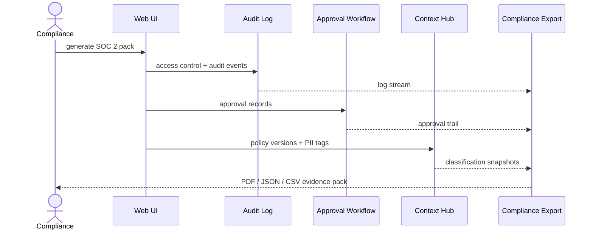

---

## Engineer scenarios

### Tech lead: multi-phase feature with 4 agents

Builds a DAG (research → design → implement → test → deploy). Each task auto-wakes when its parent completes. Each agent inherits company + project + team context + upstream outputs. Quality gates block downstream tasks if a gate fails. **No Slack dispatching, no copy-paste handoffs.**

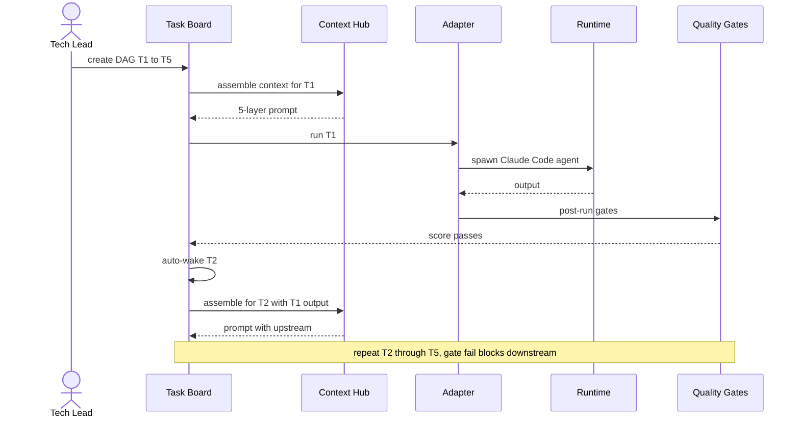

### Senior engineer: publishing a team skill

Creates skill `go-microservice-review` v1 with review checklist. Attaches to agents across 2 teams. When skill updates to v2 → all attached agents pick it up automatically. New teammate's agent inherits day 1. **Knowledge stays with the org, not the individual.**

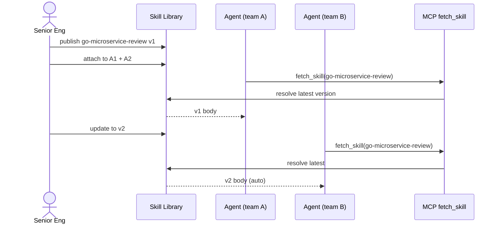

### Team engineer: forking an agent template

Clones the Platform team's `code-reviewer` template. Customizes it with team-specific context (style guide, service boundaries). Uses it for daily reviews. Two months later, shares the customized variant back for other teams to adopt.

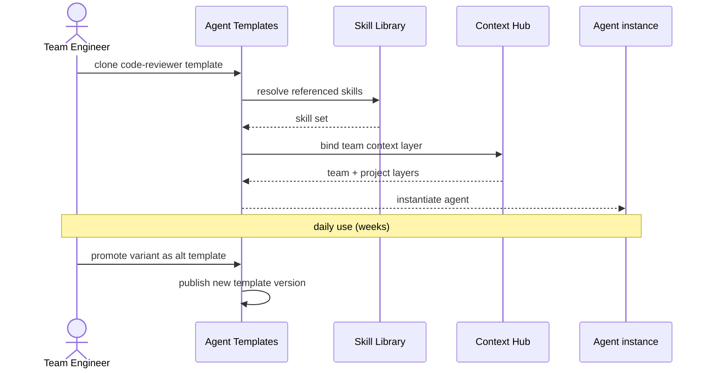

### Release manager: agent regression check before rollout

Before rolling out a new Company context version, release manager triggers the Evaluation Suite against the golden task set. Runs 50 golden tasks × 3 agents with the new context pinned. Compares scores vs baseline. If any agent regresses more than 5 points, block the rollout and investigate.

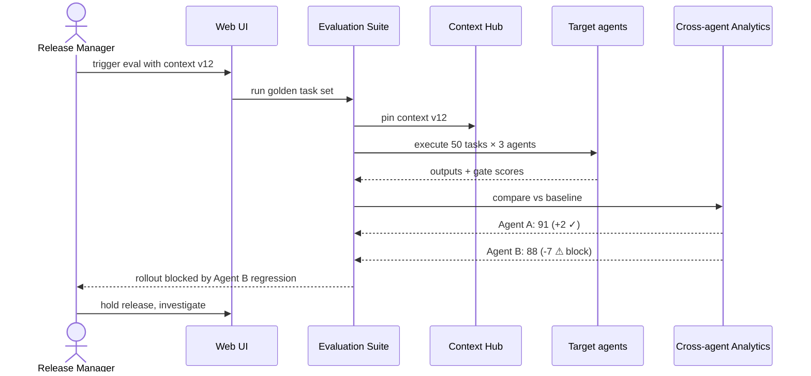

### Mid-level engineer: picking up an in-review task

Opens Task Board → task in "In Review". Sees: full prompt sent to agent, assembled context versions (company v12, project v3, team v7), agent output with self-explanation ("What I did / Why / Risks"), quality gate results. **Full reproducible state — reviews without pinging anyone.**

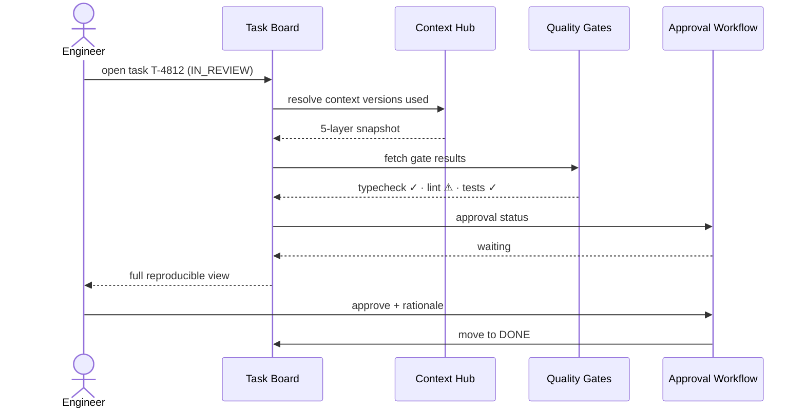

### Agent during a run: self-correcting via sensors

Mid-run, agent calls `run_typecheck` via MCP. Gets errors back. Fixes them. Calls `run_lint` — 1 warning, fixes. Finishes run. Quality gate confirms. **Self-correction before human review, not after.**

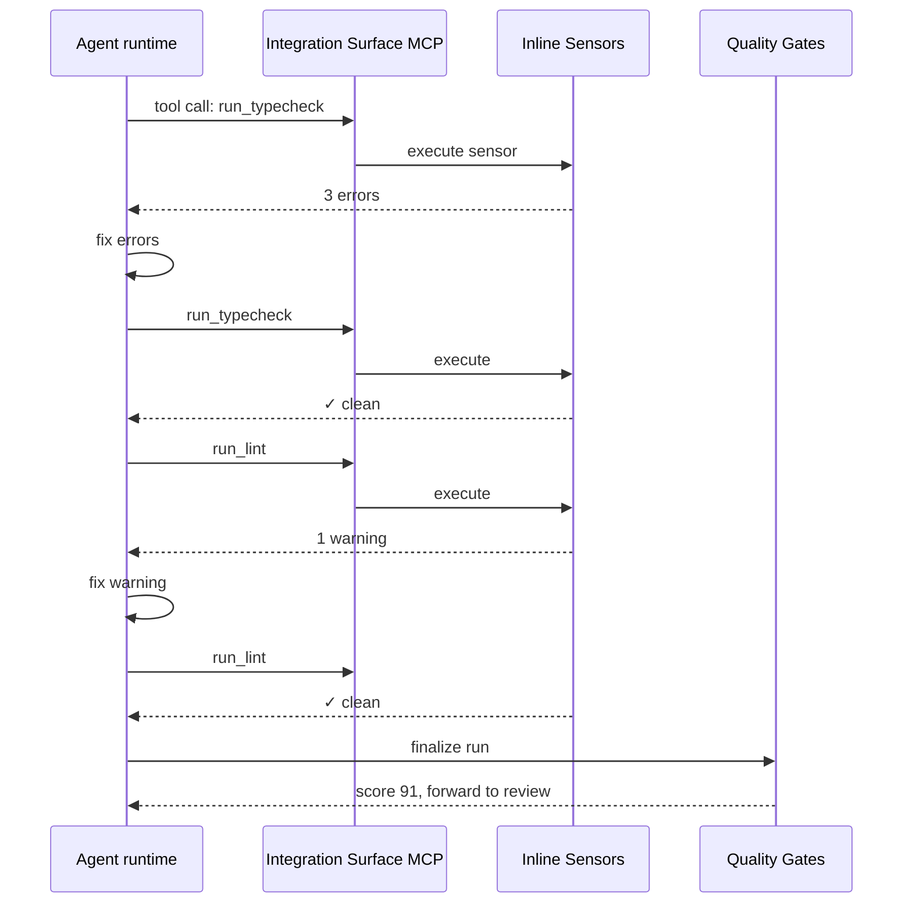

---

## The common pattern

Across all 10 scenarios, the shape is the same: **engineers work inside Dandori, leaders see through Dandori** — pulling from the same database, trusting the same audit trail, acting on the same data.

- Policies propagate automatically (no copy-paste)
- Every decision backed by data (no gut feel)
- Incidents become learnings (full reproducibility)
- Knowledge stays with the org (not the individual)

---

## Read next

[Architecture →]({{ site.baseurl }}) How these components are wired together technically — tech stack, adapter layer, ecosystem integrations, deployment
{: .fs-5 }
