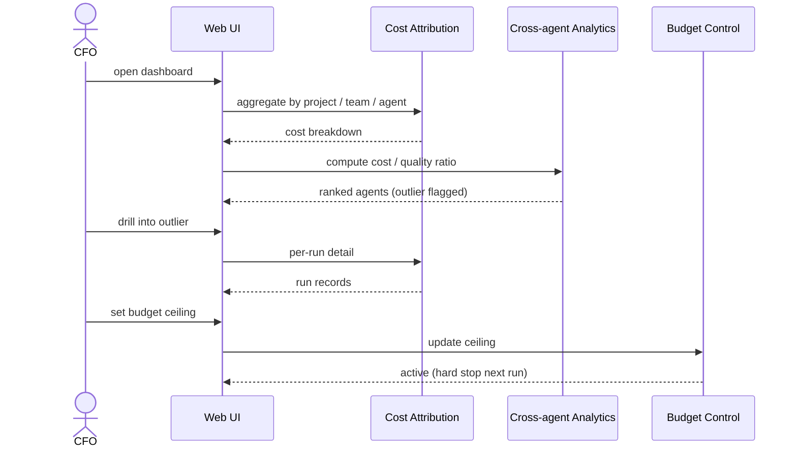
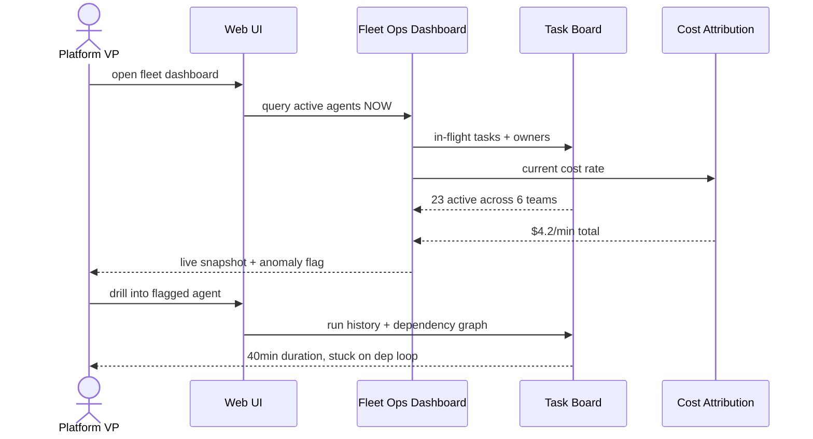
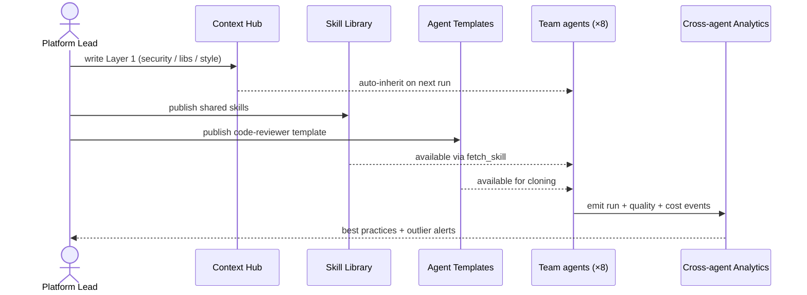
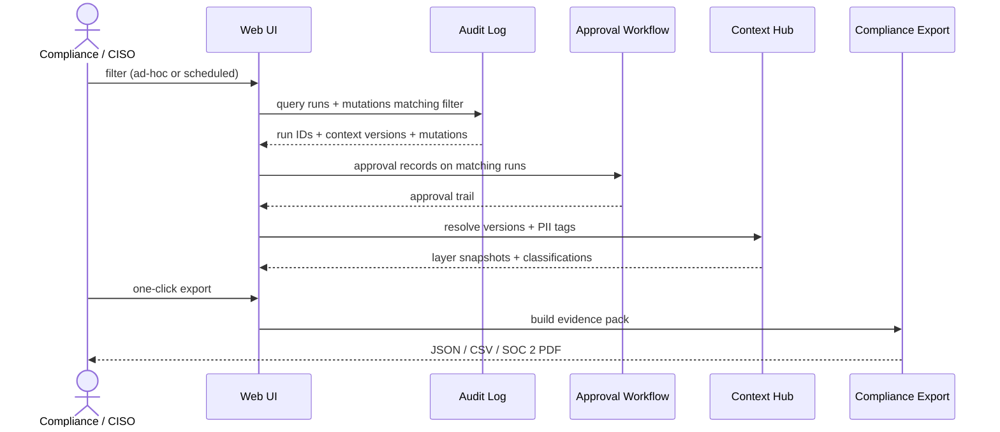
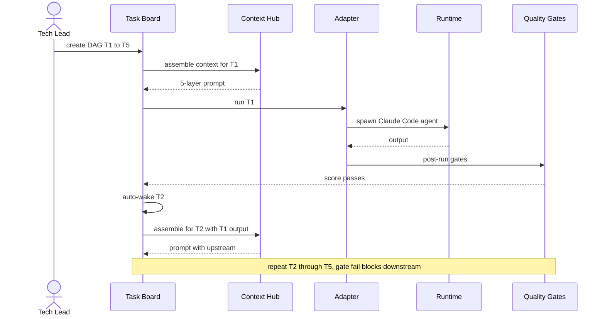
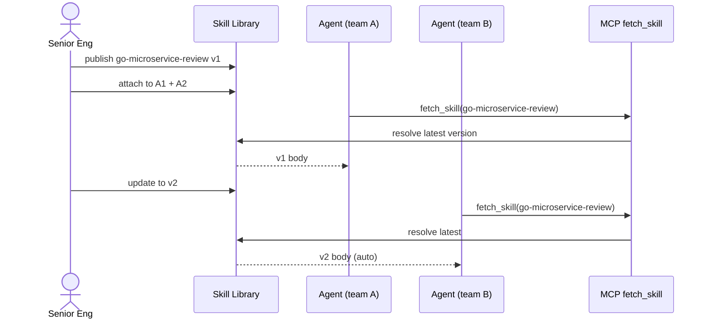
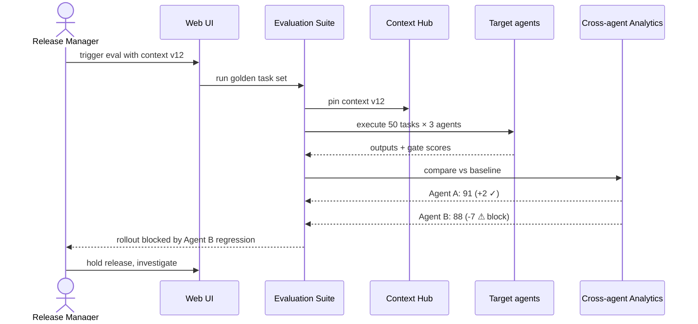
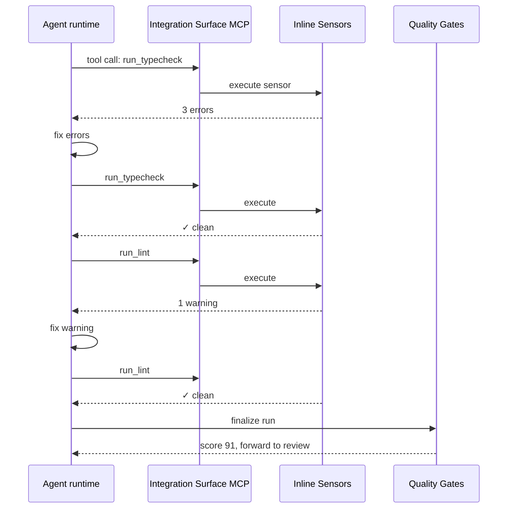

# Workflows

How the features from [Dandori Overview]({{ site.baseurl }}) actually get used. **8 iconic scenarios** — each a sequence diagram showing which Dandori components interact in a real workflow. Together they cover all 5 pillars and both directions of knowledge flow.

---

## Leadership scenarios

### 1. CFO: "Where did the AI bill go?"

Opens Cost Attribution dashboard. Drills from total spend → top project → top agent by cost-to-quality ratio. Spots an outlier burning far above baseline at low quality. Action: investigate, shift low-complexity work to a cheaper model, set a budget ceiling. **Minutes, not meetings.**

### 2. Platform VP: morning fleet check

Opens Fleet Operations Dashboard at stand-up. Live view: 23 agents active across 6 teams, total burn rate $4.2/min, owner mapping per agent. One agent flagged red — duration 40 min vs usual 12. Drills in: stuck on a dependency loop. Action: ping the owning team in Slack.

### 3. Platform lead: rolling out one standard to 8 teams

Sets Company context (Layer 1): security rules, approved libraries, style guide. Publishes shared skills and agent templates: `security-review`, `perf-analysis`, `api-design`. All 8 teams inherit automatically; each still owns its project + team context. Cross-team analytics spot best practices and flag outliers.

### 4. Compliance: audit query and evidence export

Compliance/CISO queries the audit log — either ad-hoc ("show me all PII-touching runs in Q1") or scheduled (quarterly SOC 2 pack). Audit Log joins with Approval Workflow, Context Hub (to resolve versions), and any PII classifications. One click exports a JSON / CSV / SOC 2 pack. **Every controls question an auditor asks — already logged, nothing to backfill.**

---

## Engineer scenarios

### 5. Tech lead: multi-phase feature with 5 agents

Builds a DAG (research → design → implement → test → deploy). Each task auto-wakes when its parent completes. Each agent inherits company + project + team context + upstream outputs. Quality gates block downstream tasks if a gate fails. **No Slack dispatching, no copy-paste handoffs.**

### 6. Senior engineer: publishing a team skill (bottom-up knowledge flow)

Creates skill `go-microservice-review` v1 with review checklist. Attaches to agents across 2 teams. When skill updates to v2 → all attached agents pick it up automatically via `fetch_skill` (progressive disclosure — full body fetched only when needed). **Knowledge stays with the org, not the individual.**

### 7. Release manager: regression check before rollout

Before rolling out a new Company context version, release manager triggers the Evaluation Suite against the golden task set. Runs 50 golden tasks × 3 agents with the new context pinned. Compares scores vs baseline. If any agent regresses more than 5 points, block the rollout and investigate.

### 8. Agent during a run: self-correcting via sensors

Mid-run, agent calls `run_typecheck` via MCP. Gets errors back. Fixes them. Calls `run_lint` — 1 warning, fixes. Finishes run. Quality gate confirms. **Self-correction before human review, not after.**

---

## The common pattern

Across all 8 scenarios, the shape is the same: **engineers work inside Dandori, leaders see through Dandori** — pulling from the same database, trusting the same audit trail, acting on the same data.

- Policies propagate automatically (no copy-paste)
- Every decision backed by data (no gut feel)
- Incidents become learnings (full reproducibility)
- Knowledge stays with the org (not the individual)

---

## Read next

[Architecture →]({{ site.baseurl }}) How these components are wired together technically — tech stack, adapter layer, infrastructure primitives, deployment
{: .fs-5 }
